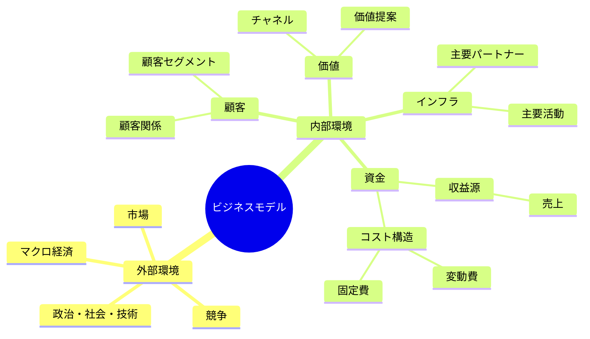
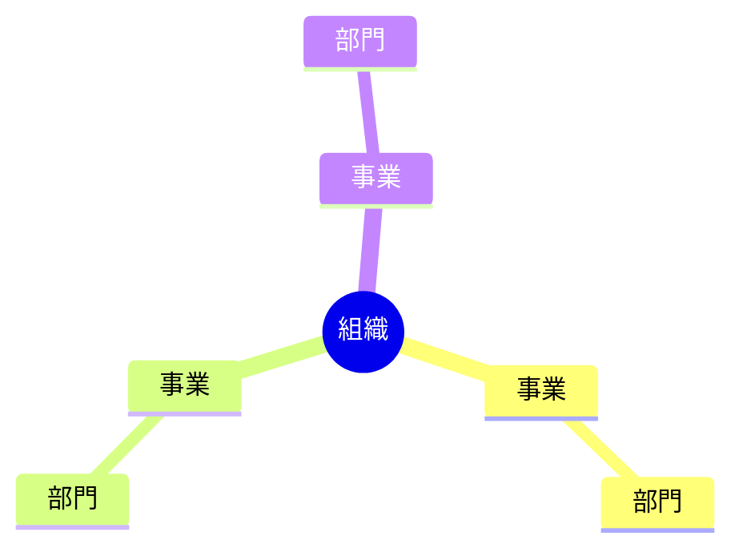
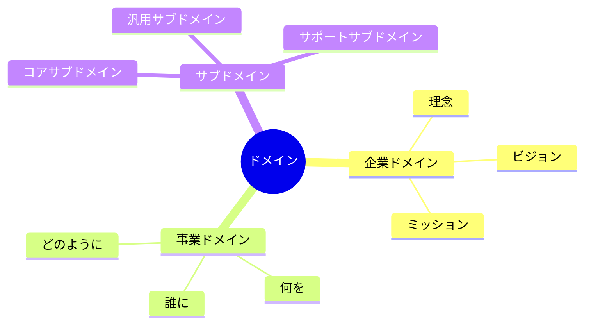
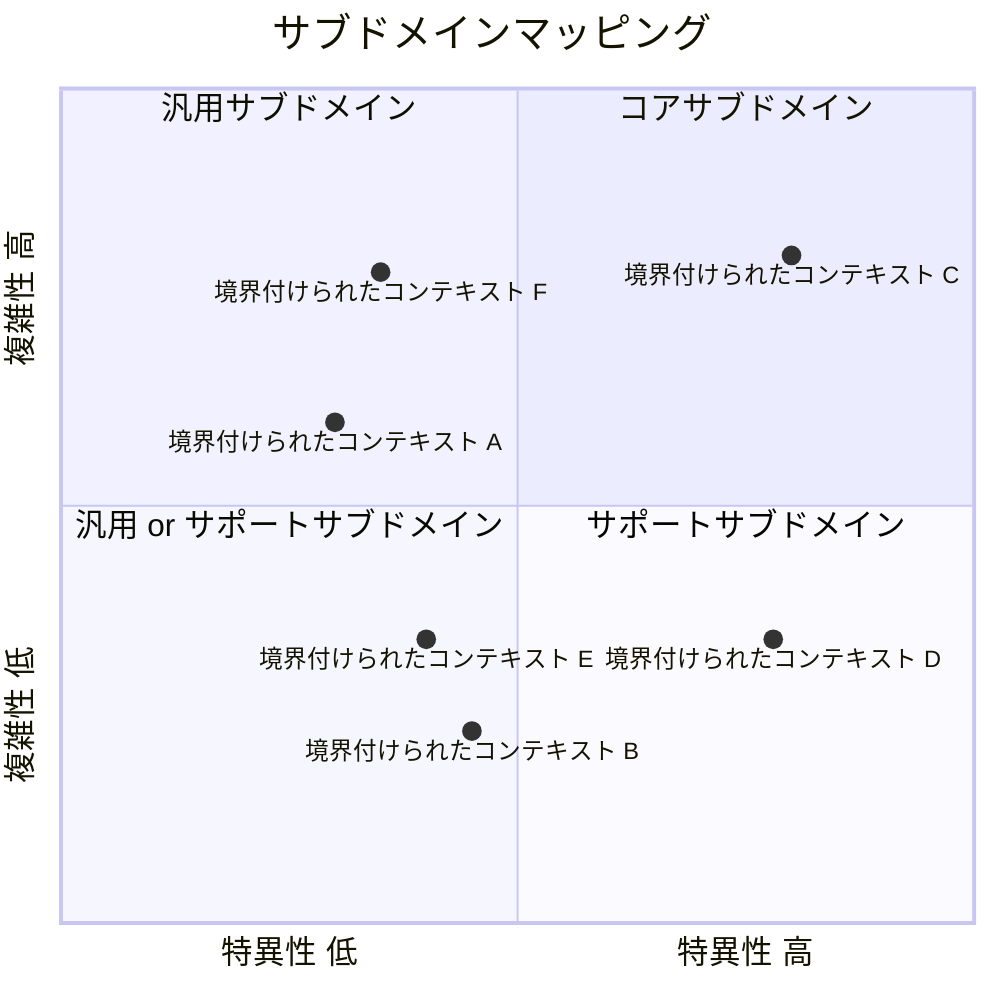

# 2. 業務分析テンプレート

業務分析を実施する際のテンプレートを検討します。

日付: 2024-11-09

## ステータス

2024-11-09 提案されました

## コンテキスト

### ビジネスモデル

### 組織

### ドメイン

## 決定

決定とその根拠

## 影響

この決定による影響

## コプライアンス

この決定が遵守されていることを確認する方法

## 備考

この決定のメタデータ（著者など）
