:toc: left
:toclevels: 5
:sectnums:
:stem:
:source-highlighter: coderay

= 企業経営理論

== 経営戦略

=== 経営活動の全体像

[plantuml]
----
@startmindmap
* 経営活動の構成
left side
** 経営理念
*** 企業の存在意義、目的
**** 変わらない
*** 意義
**** モチベーション
**** 判断基準
**** コミュニケーションのベース
*** 留意点
**** 理念を組織文化に根付かせる
***** 価値観
***** 行動規範
** ビジョン
*** 企業の将来像
*** 目標
** 社是、社訓
*** 経営理念をキャッチコピー化したもの
** ミッション
*** 企業の使命
right side
** 経営戦略
*** 目標を実現するための手段
*** 目的
**** 環境適応
**** 競争優位の獲得
*** 種類
**** 企業戦略（成長戦略）
**** 事業戦略（競争戦略）
**** 機能戦略
** 経営計画
*** 具体的な計画
**** 責任者
**** 期限有り
*** 種類
**** 長期／中期／短期
***** 長期
****** 通常、5年以上
***** 中期
****** 通常、３年程度
***** 短期
****** 通常、１年
**** 総合／部門別
*** 計画の見直し
**** ローリングプラン
***** 定期的見直し
**** コンティンジェンシープラン
***** 不測事態の対応
****** 事業継続計画（BCP）
***** シャドープラン
**** 危機管理
***** 事業継続計画
****** 事業継続管理
*** 留意点
**** 分析麻痺症候群
***** 分析ばかりで実行されない
***** スタッフ部門と事業部門の壁
** コーポレートアイデンティティ
@endmindmap
----

=== 経営活動の構成

image::images/BusinessActivitiy.svg[経営活動の構成, 600, 400]

==== 経営理念とビジョン

経営理念は、企業が存在する理由や目的を表します。これは社員のやる気を引き出す役割も果たします。経営理念は企業の基本的な考え方であり、すべての活動の基盤となります。

これに対して、ビジョンは企業が将来どうありたいかを表します。ビジョンは企業が目指す理想の姿や目標を示します。これは経営者が考える未来の企業像であり、方向性を社員や関係者に伝える役割を果たします。

経営理念とビジョンはどちらも企業経営にとって重要ですが、役割は異なります。経営理念は企業の存在意義を明確にし、社員のやる気を支える基盤です。一方、ビジョンは企業の将来像を示し、経営者の理想的な目標を表します。

=== 経営戦略

[plantuml]
----
@startwbs

* 企業戦略(成長戦略)
** 事業戦略(競争戦略)
*** 機能戦略
*** 機能戦略
*** 機能戦略
** 事業戦略(競争戦略)
*** 機能戦略
*** 機能戦略
*** 機能戦略

@endwbs
----

=== マネジメントサイクル

[plantuml]
----
@startmindmap
* マネジメントサイクル
** PDS
*** Plan
*** Do
*** See
** PDCA
*** Plan
*** Do
*** Check
*** Action
@endmindmap
----

==== PDSサイクル

[plantuml]
----
@startuml
state PDS {
    Plan -> Do
    Do --> See
    See --> Plan
}
@enduml
----

PDSサイクルは、計画 (Plan)、実行 (Do)、評価 (See) の3つのステップから成るサイクルです。

1. *Plan（計画）*::
- 目標を設定し、その目標を達成するための具体的な計画を立てます。
- 計画には目標達成のための戦略、手段、スケジュールが含まれます。

2. *Do（実行）*::
- 計画した内容を実行に移します。
- 実行の過程で進捗や問題点を確認しながら、計画通りに進めます。

3. *See（評価）*::
- 実行の結果を評価し、目標がどの程度達成されたかを確認します。
- 評価には成果の測定や課題の特定が含まれます。

==== PDCAサイクル

[plantuml]
----
@startuml
state PDCA {
    Plan -> Do
    Do --> Check
    Check --> Action
    Action -> Plan
}
@enduml
----

PDCAサイクルは、計画 (Plan)、実行 (Do)、確認 (Check)、改善 (Action) の4つのステップから成るサイクルです。

1. *Plan（計画）*::
- 目標を設定し、その目標を達成するための具体的な計画を立てます。
- 計画には目標達成のための戦略、手段、スケジュールが含まれます。

2. *Do（実行）*::
- 計画した内容を実行に移します。
- 実行の過程で進捗や問題点を確認しながら、計画通りに進めます。

3. *Check（確認）*::
- 実行の結果を確認し、計画通りに進んでいるか、目標が達成されているかを検証します。
- データの収集と分析によって現状を把握し、問題点を特定します。

4. *Action（改善）*::
- 確認した結果を基に、必要な改善策を講じます。
- 改善策を取り入れて次の計画に反映させ、再度サイクルを回します。

=== 経営戦略の基本

[plantuml]
----
@startmindmap
* 経営戦略の基本
left side
** 戦略策定プロセス
*** 環境分析
**** 現状の分析が前提
**** SWOT分析
***** 内部環境
****** 強み
******* Strength
****** 弱み
******* Weakness
****** 経営資源面
****** 機能別
***** 外部環境
****** 機会
******* Opportunity
****** 脅威
******* Threat
****** マクロ環境
****** ミクロ環境
*** 企業戦略
**** ドメイン
***** どこで戦うか
**** どの事業に投資するか
*** 事業戦略
**** 事業別にどのように戦うか
*** 機能戦略
**** 機能別の方針をどうするか
right side
** 戦略のポイント
*** 戦略のアプローチ
**** ポジショニングベース型
***** 外部環境への適応を重視
***** 有利なポジションを取る
**** リソースベース型
***** 内部の資源を重視
***** 資源ベースの戦略
*** 経営資源
**** 種類
***** 有形
****** ヒト、モノ、カネ
***** 無形
****** 技術力、知的財産、ノウハウ
****** ブランド、信用、顧客情報
**** 競争優位の要件
***** Value
****** 経済的価値
***** Rarity
****** 希少性
***** Inimitablity
****** 模倣困難性
***** Organization
****** 組織能力
**** 競争優位をもたらす経営資源
***** 経路依存性
***** 因果曖昧性
**** コアコンピタンス
***** 中核的能力
****** 顧客に価値を提供
****** 真似しにくい
****** 広く展開できる
**** ケイパビリティ
***** 組織的能力
****** スピード
****** 高品質
****** 顧客対応
**** 情報的経営資源
@endmindmap
----

==== 戦略策定プロセス

[plantuml]
----
@startuml

start

:経営理念/ビジョン;

:環境分析;
note right: SWOT分析を実施

partition 経営戦略 {
    :企業戦略;
    note right: ドメイン決定

    :事業戦略;
    note right: 事業別に詳細化

    :機能戦略;
    note right: 各機能別の戦略立案
}

stop

@enduml
----

==== SWOT分析

==== VRIO分析

image::images/VRIO.drawio.svg[VRIO分析, 600, 600]

=== 企業戦略

[plantuml]
----
@startmindmap
* 企業戦略
left side
** ドメイン
*** 事業領域
**** 誰に何を・どのように
**** 目的
***** 意思決定の焦点
***** 資源を集中
***** 組織の一体化
*** ポイント
**** 分散を回避
***** 広すぎると競争激化
**** 適度の集中の回避
***** 狭すぎると事業不成立
*** 種類
**** 企業ドメイン
**** 事業ドメイン
*** 定義方法
**** 物理的
***** モノとして定義
***** 欠点
****** マーケティング・マイオペア（近視眼）
**** 機能的
***** コトとして定義
****** 顧客視点
***** 利点
****** 発展的
***** 欠点
****** 抽象的
*** 切り口
**** 市場・顧客軸
**** 機能軸
**** 技術軸
*** ドメインの転換
**** 環境変化に適応
right side
** 多角化戦略
*** （アンゾフ）成長ベクトル
**** 事業の方向性
*** 多角化の理由
**** 外部誘因
***** 新事業分野の開拓
***** リスク分散
**** 内部誘因
***** 組織スラックの活用
****** 余剰資産
***** シナジーの追求
****** 範囲の経済
******* コスト有利
****** 相乗効果
*** 多角化の効果
**** 相乗効果
***** ノウハウや技術等を同時に多重利用
**** 相補効果
***** 経営資源を補い合う
*** 多角化の分類
**** 関連型多角化
***** シナジー効果
**** 非関連型多角化
***** 事業間の関連性が希薄
***** 相補（コンプリメント）効果
**** 水平型多角化
**** 垂直型多角化
**** 集中型多角化
**** 集成型多角化
**** アンゾフの多角化戦略
**** ルメルトの多角化戦略
*** プロダクトポートフォリオ・マネジメント
**** 複数事業の管理
***** 戦略事業単位（SBU)
**** 前提
***** 経験曲線効果
****** 累計生産量（＋）→コスト（ー）
****** シェアが高い企業がコスト有利
***** 製品ライフサイクル
****** 導入期
******* 売上（低）、CF（ー）
****** 成長期
******* 売上（増）、CF(ーから＋へ）
****** 成熟期
******* 売上（安定）、CF(＋）
****** 衰退期
******* 売上（減）、CF（低）
**** 問題点
***** 財務の視点のみ
***** 過去の分析中心
***** 負け犬のモラール低下
***** シナジー無視
**** 改善版
***** ビジネススクリーン
****** 競争地位
****** 産業魅力度
**** 相対市場シェア
*** M&A
**** 統合の方法
***** 水平統合
***** 垂直統合
***** 多角化
**** 形態
***** 経営権移転なし
****** 提携
****** 合弁
***** 経営移転あり
****** 買収
****** 合併
**** 手法
***** TOB
****** 株式公開買い付け
***** MBO
****** 現経営陣による買収
***** MBI
****** 外部経営陣による買収
***** LBO
****** 企業を担保に買収資金調達
**** 効果
***** メリット
****** スピード
****** 弱みの補強
***** デメリット
****** 企業評価が難しい
****** 組織統合難しい
**** 分類
***** 友好的
***** 敵対的
****** 経営陣から見て
**** 買収防衛策
***** ポイズンビル
****** 財務悪化策
***** クラウンジュエル
****** 魅力的な事業を売却
***** ゴールデンパラシュート
****** 取締役の高額退職金
***** ホワイトナイト
****** 友好的買収者
** 事業再構築
*** アウトソーシング
**** コスト削減
**** 経営資源の集中
**** 外部の専門性活用
*** リストラクチャリング
**** 事業構造の再構築
*** リエンジニアリング
**** BPR
***** 業務プロセスの見直し
** 規模の経済性
@endmindmap
----

==== ドメイン

[plantuml]
----
@startuml
title 企業ドメインと事業ドメイン
component 企業全体 {
    package "企業ドメイン" as domain {
       package "事業ドメイン" as sub1 {
       }
       package "事業ドメイン"  as sub2 {
       }
        note top of sub1
            特定事業が競争する領域
        end note
        note top of sub2
            特定事業が競争する領域
        end note

    }
    note top of domain
        企業全体として競争する領域
    end note
}

@enduml
----

ドメインは、事業を行う領域を指し、「誰に」「何を」「どのように」提供するのかを定義します。企業は一般に多角化（複数の事業を展開）しているため、それぞれのドメインは次のように機能します：

* 企業ドメイン：
** 企業の経営理念やアイデンティティに基づいて、企業全体の活動範囲や事業領域を決定します。
** 企業の将来の方向性や経営理念を考慮し、展開する事業領域を絞り込む役割を果たします。
** 企業全体を包括する範囲を表します。複数の事業ドメインを含み、企業の戦う範囲（事業）を限定する助けになります。
* 事業ドメイン：
** 具体的な事業範囲や事業の見方を決めるもので、競争戦略の基本方針を提供します。
** 各事業単位の具体的な範囲を表し、個々の事業がどの領域で競争するかを決定します。

企業ドメインと事業ドメインは異なる概念ですが、どちらも企業経営において欠かせない役割を果たします。

==== アンゾフの成長ベクトル

image::images/Ansoff.drawio.svg[アンゾフの成長マトリクス, 600, 400]

アンゾフの成長ベクトルは、企業が成長するための4つの方向性を示しています。これは「新製品」か「現有製品」か、「新市場」か「現行市場」かの2つの観点を組み合わせた戦略を考え、合計4つの成長オプションを提示するものです。企業はこの4つの組み合わせから成長戦略を選択し、方向性を決定します。

==== プロダクトポートフォリオ・マネジメント

image::images/PPM.drawio.svg[プロダクトポートフォリオ・マネジメント, 600, 400]

縦軸は市場の成長速度を示し、製品の成熟度を評価します。横軸の相対的市場シェアは、企業の市場位置を示します。シェアが1を超えるとトップ企業であり、成長期にある製品や事業は重要な資金源となります。経験曲線効果により、シェアが高いほど利益を生む可能性が高くなります。

=== 事業戦略

[plantuml]
----
@startmindmap
* 事業戦略
left side
** 業界構造増分析
*** 5つの競争要因
**** ポーター
**** 収益性を決定
*** 競争環境
**** 競争業者
***** 既存業者の敵対関係
****** 競合他社が多い
******* 規模が同等
****** 成長率が低い
****** 差別化ができていない
****** 固定費が高い
**** 買い手
***** 買い手の交渉力
****** 強力な買い手
****** 製品が差別化されていない
**** 売り手
***** 売り手の交渉力
****** 売り手が少数で支配
****** 独自の製品・技術
**** 新規参入者
***** 新規参入の脅威
****** 参入障壁
******* 技術
******* 設備投資
******** 規模の経済
******* チャネル
**** 代替品
***** 代替品の脅威
**** 業界
***** 戦略グループ
****** 同じような戦略の企業
****** 同じ業界内
***** 移動障壁
****** 戦略グループ間の移動
right side
** 競争優位の戦略
*** ３つの基本戦略
**** コストリーダーシップ
***** 手段
****** 規模の経済性
****** 経験曲線効果
***** リスク
****** 価格競争
****** ニーズ変化
**** 差別化
***** 手段
****** 製品
****** サービス
****** ブランド
***** リスク
****** 価格差
****** 陳腐化
**** 集中
***** コスト集中
***** 差別化集中
***** リスク
****** 事業不成立
****** セグメントがあいまい
*** 価値連鎖
**** 利益
***** 付加価値を高める
***** コストを下げる
**** 価値活動
***** 全体最適
*** 競争地位別の戦略
**** リーダー
***** 市場拡大
****** フルライン
***** 同質化
**** チャレンジャー
***** 差別化
**** ニッチャー
***** 集中
****** ミニリーダー政策
**** フォロワー
***** 追随
@endmindmap
----

==== 5つの競争要因

[plantuml]
----
@startmindmap

* 競争業者
left side
** 新規参入業者
** 売り手
right side
** 代替品
** 買い手

@endmindmap
----

==== 3つの基本戦略

image::images/ThreeGenericStrategies.drawio.svg[3つの基本戦略, 600, 400]

==== 価値連鎖

image::images/ValueChain.drawio.svg[価値連鎖, 600, 400]

=== 技術戦略(MOT)

[plantuml]
----
@startmindmap
* 技術戦略（MOT）
left side
** イノベーション
*** 革新
**** プロダクト・イノベーション
***** 製品
**** プロセス・イノベーション
***** 生産工程
*** ライフサイクル
**** S字カーブ
***** １不確実
***** ２拡大
***** ３成熟
**** 不連続性
***** 新技術
*** 種類
**** 持続的
***** インクリメンタル
***** 改良
****** 主流顧客向け
**** 破壊的
***** ラディカル
***** 新しい価値
****** 新規顧客
*** イノベーションのジレンマ
**** リーダー企業
***** 破壊者に対応できない
***** 主要顧客の要望
*** オープンイノベーション
** 製品アーキテクチャ
*** 種類
**** インテグラル型
***** すり合わせ
***** 利点
****** 全体最適
****** 模倣困難
***** 欠点
****** 進化に時間
****** 調整コスト
**** モジュール型
***** 組合わせ
****** インターフェース
***** 利点
****** 多様な組み合わせ
****** 調整コスト削減
***** 欠点
****** 無駄が多い
****** I/Fの進化に時間
***** オープンアーキテクチャ戦略
*** デファクトスタンダード
**** 事実上の業界標準
***** ⇔デジュリ（公的）
**** ネットワーク外部性
***** メンバー（＋）⇔効用（＋）
right side
** ベンチャー企業
*** 成長過程
**** シード期
**** スタートアップ期
**** 急成長期
**** 安定成長期
*** 課題
**** 魔の川
***** 社会的有用性が識別困難
**** 死の谷
***** 商品化前に転落
**** ダーウィンの海
***** 競争による淘汰
*** Jカーブ効果（Jカーブ曲線）
**** キャッシュフロー
**** 時間
** 社内ベンチャー
*** 目的
**** 新規事業
**** チャレンジ精神
**** 既存資産の有効活用
*** メリット
**** 経営資源の活用
**** ブランド力・信用を活かす
**** リスクを抑える
*** デメリット
**** 組織的な承認が必要
**** 既存事業の制限
@endmindmap
----

== 経営組織

=== 組織構造

[plantuml]
----
@startmindmap
* [#lightblue] 組織の構造
left side
** 組織とは
*** 組織の要素
**** 共通目的
**** 貢献意欲
**** コミュニケーション
*** 均衡条件
**** 誘因≧貢献
*** 基本構造
**** 階層
**** 分業化
**** 機械的管理システム
**** 有機的管理システム
*** 戦略との関連
**** 組織は戦略に従う
***** チャンドラー
**** 戦略は組織に従う
***** アンゾフ
** 組織の設計原則
*** 専門家の原則
*** 権限・責任一致の原則
*** 統制範囲の原則
**** スパン・オブ・コントロール
*** 命令一元化の原則
*** 例外の原則
**** 権限委譲
right side
** 組織形態
*** 基本体系
**** ライン組織
***** ピラミッド型
**** ライン・アンド・スタッフ組織
***** ライン
****** 主活動
***** スタッフ
****** 支援活動
*** 一般形態
**** 機能別組織
***** 利点
****** 専門化
******* 効率化
****** 統制
******* 管理者権限
***** 欠点
****** 管理者負担
****** 硬直化
******* 官僚制の逆機能
****** 利益責任不明確
**** 事業部制組織
***** 分権管理
****** プロフィットセンター
******* 製品／地域／顧客
***** 利点
****** 迅速な意思決定
****** トップ負担軽減
****** 管理者育成
***** 欠点
****** 非効率
******* 機能の重複
****** セクショナリズム
****** 短期的視点
**** カンパニー制
***** 社内分社化
****** インベストメントセンター
****** バランスシート経営
****** プレジデント
***** 利点
****** 経営責任が明確
****** 意思決定が迅速
****** 企業家精神
***** 欠点
****** カンパニー間の連携
****** 本社の意向
**** マトリクス組織
***** 格子型
****** 複数の命令系統
***** 利点
****** 機能ｘ事業別のメリット追求
****** 人材共有
***** 欠点
****** 命令系統
******* ワンマンツーボス
****** 管理者の権力争い
** 組織の運営
*** 組織のライフサイクル
**** 起業者段階
***** リーダーシップ
**** 共同体段階
***** 権限委譲
**** 公式化段階
***** 官僚制の逆機能の打破（組織構造の動態化）
****** フラット化
****** プロジェクト組織
****** 情報共有
**** 精緻化段階
***** 再活性化
*** 環境変化への対応
**** 組織のコンティンジェンシー理論
***** 環境により最適な構造は異なる
***** 安定
****** 官僚的組織
***** 不安定
****** 水平
****** 分化＋統合機能
****** コンフリクトを解決
**** 不確実性への対応
***** 情報を減らす
****** 余分な資源を追加（スラック資源）
****** 自己完結組織
***** 情報処理能力を増やす
****** 横断的組織
******* タスクフォース
******* マトリクス組織
****** 情報処理システム
*** 組織間関係論
**** 資源依存モデル
***** 外部に制限
***** 依存度の要因
****** 資源の重要性
****** 外部組織の自由裁量
****** 資源の集中度
***** 依存のマネジメント
****** 代替・多角化
****** 協調
**** 取引コストアプローチ
***** 取引コスト
****** 交渉・契約
****** 監視
***** 取引のマネジメント
****** コスト高＝＞内部化
****** コスト低＝＞外部業者
@endmindmap
----

=== 組織と人材

[plantuml]
----
@startmindmap
left side
* 組織と人材
** 経営管理の発展
*** テイラーの科学的管理法
**** 課業管理
***** 以前＝成行管理
***** 時間研究
***** 動作研究
**** ４つの管理原則
***** 課業
***** 標準条件
***** 成功＝＞高賃金
***** 失敗＝＞低賃金
**** 成果
***** IE:経営工学
**** 問題点
***** 対象が作業のみ
***** 人間的要素を無視
****** 経済人モデル
*** 人間関係論
**** ホーソン実験
***** 当初の目的
****** 作業条件が労働者に与える影響
***** 発見
****** 作業条件は生産性に影響しない
****** 人間関係が影響
***** レスリスバーガー
****** 社会人モデル
****** インフォーマル組織
**** 問題点
***** 感情だけでは生産性向上しない
***** 個人目的・自立行動を検討しない
right side
** モチベーション理論
*** 内容理論
**** マズロー
***** 欲求段階説
****** 自己実現
****** 自我
****** 社会的
****** 安全
****** 生理的
***** 低次＝＞高次へ
****** 自己実現は無限
**** マグレガー
***** X理論・Y理論
****** X理論
******* 怠け者
******** ＝＞命令・統制
****** Y理論
******* 自発的
******** ＝＞目標による管理（MBO）
**** ハーズバーグ
***** 動機づけ・衛生理論
****** 衛生要因
******* 不満足要因
****** 動機づけ要因
******* 満足要因
******* ＝＞職務充実 垂直的拡大（ジョブ・エンリッチメント）
**** アージリス
***** 未成熟・成熟理論
****** 未成熟＝＞成熟
******* 能動的行動
****** ＝＞職務拡大（ジョブ・エンラージメント）
******* 水平的拡大
*** 過程理論
**** ブルーム
***** 期待理論
****** 動機づけ
******* 報酬の期待価値ｘ確率
****** 人により報酬は異なる
**** アクレランド＝アトキンソン
***** 達成動機説
****** 高い達成動機を持つ人
******* 迅速なフィードバック
******* 中程度のリスク
*** 職務特性モデル
**** 技術多様性
**** 完結性
**** 重要性
**** 自律性
**** フィードバック
*** 内発的動機づけ理論
**** デシの内発的動機づけ
**** チクセントミハイのフロー心理学
**** ホワイトのコンピテンス（有能性）概念
*** 目標設定理論
** リーダーシップ理論
*** 定義
**** 目標を達成／人々に影響
*** 源泉
**** 組織から付与
***** 合法、報酬、強制
**** 個人
***** 専門、準拠
*** 変遷
**** 資質特性論
***** 個人特性
****** 統一見解なし
**** 行動類型論
***** レヴィン
****** リーダシップ類型論
******* 専制型
******** △
******* 民主型
******** ○
******* 放任型
******** ｘ
***** リカート
****** システムⅣ理論
******* １．独善的専制型
******* ２．温情的専制型
******* ３．相談型
******* ４．参加型
******** ○
********* 連結ピン
***** ブレーク＝ムートン
****** マネジアル・グリット
******* 人間への関心ｘ業績への関心
******* ＝＞共に高い方が良い
***** オハイオ研究
****** 構造作り
******* 仕事志向
****** 配慮
******* 人間関係志向
***** 三隅二不二のPM理論
**** コンティンジェンシー理論
***** フィードラー
****** 仕事中心型
******* 統制しやすい状況
******* 統制しにくい状況
****** 人間関係中心型
******* 中間的状況
***** ハウス
****** パス＝ゴール理論
******* リーダー
******** 目標＝経路を示す
******** リーターシップ・スタイル
******* 期待理論に基づく
**** SL（状況）理論
**** リーダー・メンバー交換（LMX）理論
***** 内集団（in-group：好意的に振舞う）
***** 外集団（out-group：非好意的に振舞う）
*** 権威受容説
** 組織活性化
*** 組織文化
**** 定義
***** 価値・信念
***** 行動パターン
**** 戦略の実行能力に影響
**** 組織開発
***** 組織文化の変革
***** 教育訓練／コンサルティング
**** キャメロンとクインの組織文化理論
**** 組織コミットメント
***** 情緒的コミットメント
***** 功利的コミットメント
***** 規範的コミットメント
***** 態度的コミットメント
**** 組織アイデンティティ
*** 集団の行動
**** 凝集性が高い集団＝＞集団浅慮
**** コンフリクト
***** 発生要因
****** 資源配分
****** パワーを求める
****** 共通目的の欠如
***** コンフリクト・マネジメント
****** 協力
*** 組織学習
**** 組織の発展
***** 低次学習
****** シングルループ
******* 既存枠組み
***** 高次学習
****** ダブルループ
******* 変革
***** SECIモデル
****** 共同化（Socialization）
****** 表出化（Externalization）
****** 連結化(Combination）
****** 内面化(Internalization）
*** 戦略的組織変革
**** 抵抗
***** コスト
****** 埋没コスト
***** 認識不足
***** 現状維持
**** 変革の遂行
***** 必要性の認識
****** リッチな情報
****** コンフリクト活用
***** 変革案
****** 多様な人材活用
***** 実施・定着
****** 制度的リーダーシップ
**** 組織開発
***** 人間尊重の価値観
***** 民主的な価値観
***** 当事者中心の価値観
***** 社会的・エコロジカル的システム指向の価値観
**** 解凍-変化-再凍結モデル
***** 解凍
***** 変化
***** 再凍結
@endmindmap
----

=== 人的資源管理

[plantuml]
----
@startmindmap
* 人的資源管理
left side
** 雇用管理
*** 多様化
**** 正社員
**** 非正規社員
*** 採用管理
**** 採用計画
**** 募集・選考・採用
**** インターンシップ
*** 配置・移動
**** 種類
***** 垂直
****** 役職
******* 昇進／降職
****** 職能資格
******* 昇格／降格
******* 参与、参事など
***** 水平
****** 配置転換
******* 適材適所
******* 従業員の育成
******* 組織活性化
**** 施策
***** ジョブローテーション
***** キャリア・デベロップメント・プログラム（CDP)
***** 社内公募制
***** 複線型人事制度
*** 退職
**** 自己都合／会社都合
**** 制度
***** 定年退職
***** 雇用延長
****** 定年の廃止
***** 早期退職優遇制度
*** 雇用調整
**** 残業、パート、採用削減、配置、希望退職、解雇
** 評価制度
*** 目的
**** 処遇
**** 配置・教育
**** キャリア開発
*** 評価方法
**** 日本
***** 年功・終身雇用
***** 能力主義
**** 近年
***** 成果主義
****** 利点
******* モチベーション
******* 人権の抑制
****** 欠点
******* 短期的
******* 個人主義
****** 留意点
******* 公平性・透明性
******* 個人の裁量
******* 能力開発
***** 目標管理制度（ＭＢＯ）
****** 利点
******* 創意工夫・やる気
******* 上司とコミュニケーション
****** 欠点
******* 低い目標
******* 業務による違い
******* 評価の負担
***** コンピテンシー評価
****** 行動特性
****** プロセス評価
*** 心理的誤差
**** ハロー効果
**** 中央化
**** 寛大化
**** 論理誤差
**** 対比誤差
*** 施策
**** 考課者訓練
**** 多面評価
***** ３６０度評価
right side
** 報酬管理
*** 昇給
**** 定期昇給
***** 査定昇給
***** 自動昇給
**** ベースアップ
*** 基本給
**** 年功給
**** 職能給
**** 職務給
**** 成果給
*** 賞与
**** 総額の算定
**** 個別算定
***** 算定基礎額ｘ支給月数ｘ査定率
*** 退職金
**** 問題点
***** 負担大
****** 年功賃金
**** 対策
***** ポイント制退職金
***** 確定拠出型年金⇔確定給付型
** 能力開発
*** ＯＪＴ
**** 利点
***** 実務能力
***** きめ細かい指導
***** コスト
**** 欠点
***** 短期志向
***** 上司に左右
***** 体系的でない
*** OFF-JT
**** 利点
***** 体系的
***** 新しい知識
**** 欠点
***** コスト
***** 実務能力の習得が難しい
@endmindmap
----

=== 労働関連法規

[plantuml]
----
@startmindmap
* 労働関連法規
left side
** 労働基準法
*** 目的
**** 労働者保護
*** 労働条件
**** １．法令
**** ２．労働協約
***** 労働組合⇔使用者
**** ３．就業規則
***** 企業の労働条件
***** 義務
****** １０人以上
***** 記載事項
****** 絶対的
******* 労働時間／賃金／退職
****** 相対的
******* 定めをする場合
****** 任意的
***** 手続き
****** 意見を聞く
******* 労働組合
******* 労働者の過半数代表
**** ４．労働契約
***** 労働者⇔使用者
***** 期間
****** 定めなし
****** 定めあり
******* 原則３年
******* ５年
******** 専門知識
******** ６０歳以上
*** 解雇
**** 制限
***** 休業中（業務事由）
***** 産休＋３０日間
**** 予告
***** ３０日前／３０日分賃金
***** 即時
****** 天災／労働者の責
*** 賃金
**** 支払いの５原則
***** 通貨／直接／全額／毎月１回／一定期日
**** 割増賃金
***** 時間外
****** ２５％
******* １ヶ月６０時間超　５０％
***** 休日
****** ３５％
***** 深夜
****** ２５％
*** 労働時間
**** 法定労働時間
***** ８時間／１日、４０時間／１週間
****** 休憩除く
***** 特例
****** ４４時間
******* １０人未満＆特定事業
**** 変形労働時間
***** １ヶ月単位
***** フレックスタイム制
****** 労働者が時刻決定
***** １年単位
***** １週間単位
****** 特定業種
**** 休憩
***** 労働８時間超
****** １時間
***** 労働６時間超
****** ４５分
***** 労働時間中、一斉、自由
**** 休日
***** １日／週
***** 変形休日制
****** ４日／４週
**** 時間外／休日労働
***** ３６協定
****** 労働組合
****** 労働者の過半数代表
**** みなし労働時間
***** 事業場外
***** 裁量労働
****** 専門業務型
****** 企画業務型
**** 年次有給強化
***** 要件
****** ６ヶ月・８割勤務
****** パート含む
******* 比例付与
***** 日数
****** １０日～
***** 時季
****** 原則労働者
****** 使用者
******* 正常な事業運営を妨げる場合
****** 比例付与
******* パート・バイトなど
***** 計画的付与が可能
****** ５日超の部分
****** 使用者が時季決定
**** 適用除外
***** 監督管理者
right side
** その他の法規
*** 労働安全衛生法
**** 労働者の安全・健康＊快適な職場環境
**** 体制
***** 総括安全衛生管理者
****** １００人～
***** 安全管理者
****** ５０人～／業種指定
***** 衛生管理者
****** ５０人～
***** 産業医
****** ５０人～
**** 健康診断
***** 義務
*** 労働組合法
**** 労働組合
**** 不当労働行為
***** 不利益な取り扱い
***** 黄犬契約
****** 雇用条件
***** 団体交渉拒否
***** 支配介入
***** 経費援助
**** 労働協約
***** 労働組合⇔使用者
****** 団体交渉⇒労働条件
***** ⇔労使協定
****** 免罰効果のみ
*** 労働保険
**** 労働者災害補償保険法
***** 労災保険
****** 義務
***** 種類
****** 業務災害
****** 通勤災害
**** 雇用保険法
***** 雇用・生活の安定
****** 週２０時間以上、３１日以上の雇用見込み
***** 失業等給付
****** 求職者給付
****** 就職促進給付
****** 教育訓練給付
****** 雇用継続給付
******* 高齢者、育児休業、介護休業
*** 社会保険
**** 健康保険法
***** 疾病、負傷、死亡、出産
***** 負担
****** 事業主／被保険者が半分
**** 厚生年金基金法
***** 公的年金
****** 厚生年金基金
******* 私的年金
****** 厚生年金
******* 報酬比例
****** 国民年金
******* 基礎年金
*** 育児・介護休業法
**** 仕事と育児の両立支援
***** 育児休業
****** 原則、子が１歳になるまで
****** 事情があれば２歳になるまで
***** 子の看護休暇
****** 小学校入学前の子
****** １人であれば年５日まで
****** ２人以上は年１０日まで
**** 仕事と介護の両立支援
***** 介護休業
****** 要介護の家族
****** １人につき３回まで
****** 通算９３日まで
***** 介護休暇
****** 要介護の家族
****** 1人であれば年５日まで
****** ２人以上は年１０日まで
*** 労働契約法
**** 労使対応
**** 均衡考慮
**** 仕事と生活の調和
**** 信義誠実
**** 権利濫用の禁止
** 心理的契約
@endmindmap
----

== マーケティング

=== マーケティングの概要とプロセス

[plantuml]
----
@startuml
@startmindmap

* マーケティング概要とプロセス
left side
** マーケティングの基礎
*** マーケティングとは
**** 売れる仕組みづくり
***** ⇔　セリング
**** コトラー
***** 価値の創造と交換
***** ニーズと欲求を満たす
**** AMA2007
***** 顧客、依頼人、パートナー、社会全体
***** 価値のある提供物を創造・伝達・配達・交換
***** 一連の制度、そしてプロセス
*** コンセプト
**** 生産志向
***** 生産効率
**** 製品志向
***** 製品の改良
***** マーケティング・マイオペア（近視眼）
**** 販売志向
***** 販売効率
**** 顧客志向（マーケティング志向）
***** 顧客ニーズ
**** 社会志向
***** 社会的責任
***** ソーシャルマーケティング
****** 非営利組織への適用
***** ソサエタルマーケティング
****** 社会全体の福祉を向上
***** コーズ・リレイティッド・マーケティング
****** 利益の一部を寄付
***** CSV
*** 階層
**** 戦略的マーケティング
***** 企業戦略レベル
**** マーケティング・マネジメント戦略
***** ４Pを統合
**** マーケティング機能要素別戦略
***** 製品（Product）
***** 価格（Price）
***** チャネル（Place）
***** プロモーション（Promotion）
*** プロセス
**** 環境分析
***** SWOT分析
***** マーケティング・リサーチ
**** 目標設定
***** 売上高
***** 利益
***** シェア
**** 標的市場の選定
**** マーケティングミックス
right side
** 消費者行動
*** マーケティング・リサーチ
**** プロセス
***** 調査目的
***** 2次データの調査
***** 1次データの収集
***** 結論
**** 収集方法
***** 質問法
****** 面接法
******* 利点
******** 視覚ツール、反応に応じた質問、回答率
******* 欠点
******** 高コスト、調査員による隔たり
****** 集団面接法
******* 利点
******** 面接に比べ低コスト、集団での発言
******* 欠点
******** 司会の能力次第
****** 電話法
******* 利点
******** 短時間、面接に比べ低コスト
******* 欠点
******** 不信感
****** 郵送法
******* 利点
******** 低コスト
******* 欠点
******** 回収率、チェック、時間がかかる調査
****** 留置法
******* 利点
******** 回収率、チェック、時間がかかる調査
******* 欠点
******** 調査対象者以外の意見
****** その他
******* ファックス調査
******* インターネット調査
*** 購買行動
**** 購買意思決定プロセス
***** 問題認知
***** 情報探索
***** 代替品評価
***** 購買決定
***** 購買後の行動
****** 認知的不協和
**** 購買行動タイプ
***** 日常的反応行動
****** 最寄品
***** 限定的問題解決
****** 買回品
***** 拡大的問題解決
****** 専門品
**** 購買行動の規定要因
***** 文化的
***** 社会的
***** 個人的
***** 心理的
**** 組織購買行動
***** 集団意思決定
***** 長期的
***** 専門性
**** イノベーター理論
***** イノベーター
***** アーリーアダプター
***** アーリーマジョリティ
***** レイトマジョリティ
***** ラガード
**** ムーアのキャズム理論
*** 消費者行動理論
**** アサエルの購買行動類型型
***** 情報処理型
****** 高関与、ブランド知覚差異は大
***** バラエティ・シーキング型
****** 低関与、ブランド知覚差異は大
***** 不協和低減型
****** 高関与、ブランド知覚差異は小
***** 習慣型
****** 低関与、ブランド知覚差異は小
**** 消費者行動と関与
***** 認知的関与
***** 感情的関与
**** AIDMA
***** Attention（注意）
***** Interest（関心）
***** Desire（欲求）
***** Memory（記憶）
***** Action（行動）
**** AISAS
***** Attention（注意）
***** Interest（関心）
***** Search（検索）
***** Action（行動）
***** Share（共有）
**** 精緻化見込みモデル
***** 中心ルート
****** 広告の内容に対応
***** 周辺ルート
****** 広告のイメージに対応
**** 多属性態度理論・多属性意思決定
***** 加算型
****** 全ての属性を評価
***** 連結型
****** 最低限の水準を設定
***** 辞書編纂型
****** 一案重視する属性で評価
***** EBA型
****** 基準を満たさない属性のある製品は選択しない
***** 感情依拠型
****** 好意的に感じる製品を選ぶ
**** 顧客ロイヤルティ
**** 準拠集団
left side
** 標的市場の選定
*** ターゲット・マーケティング
**** 経営資源の活用
**** 顧客ニーズの対応
*** 市場細分化（セグメンテーション）
**** 基準
***** 地理的
****** ジオグラフィック
***** 人口統計的
****** デモグラフィック
***** 心理的
****** サイコグラフィック
***** 行動変数
****** ベネフィット
****** 使用率
****** ロイヤルティ
**** 要件
***** 実行可能性
***** 維持可能性
***** 到達可能性
***** 測定可能性
*** 標的市場（ターゲティング）
**** セグメントの評価と決定
**** アプローチ
***** 無差別型
****** 利点
******* 低コスト
****** 欠点
******* ニーズ対応
***** 差別型
****** 利点
******* 売上最大
****** 欠点
******* 高コスト
***** 集中型
****** 利点
******* 経営資源
****** 欠点
******* 高リスク
*** ポジショニング
**** ポジショニング・マップ
***** 差別化
**** 自社内
***** カニバリゼーション

@endmindmap
@enduml
----

=== 製品戦略

[plantuml]
----
@startmindmap

* 製品戦略
left side
** 製品の定義
*** 3層モデル
**** 核
**** 形態
**** 付随機能
*** 分類
**** 有形財（製品）
***** 消費財
****** 最寄品
****** 買回品
****** 専門品
****** 非探索品
***** 産業財
**** 無形財（サービス）
** プロダクト・ミックス
*** 製品ラインの幅
*** 製品アイテムの深さ
** 製品ライフサイクル
*** 導入期
*** 成長期
*** 成熟期
*** 衰退期
**** 計画的陳腐化政策
right side
** ブランド
*** 定義
**** 識別
***** 名称、記号、シンボル、デザイン
**** ブランド価値
***** 基本価値
***** 便宜価値
***** 感覚価値
***** 観念価値
**** ブランド要素
***** ブランド・ネーム
***** ブランド・マーク
***** 商標権
***** パッケージ
***** スローガン
***** ジングル
***** キャラクター
***** 色
*** 機能
**** 出所表示
**** 品質保証
**** 広告宣伝
**** ブランド・エクイティ
***** ブランド・ロイヤルティ
***** 知覚品質
***** ブランド連想
*** 種類
**** 所有者
***** ナショナルブランド
***** プライベートブランド
**** ブランド採用戦略
***** ファミリーブランド
***** ダブルブランド
***** 分割ファミリーブランド
***** 個別ブランド
***** ブランド・プラス・グレード
**** ブランド基本戦略
***** ライン拡張
***** ブランド拡張
***** マルチブランド
***** 新ブランド
*** ブランドカテゴライゼーション
**** 想起集合
**** 拒否集合
**** 保留集合
** 新製品開発プロセス
*** コンセプト
**** アイデア
**** スクリーニング
**** 製品コンセプト
*** 戦略
**** マーケティング戦略
**** 経済性評価
*** 製品化
**** 製品開発
***** 試作品
**** テスト・マーケティング
**** 製品生産
** パッケージング
*** 機能
**** 運搬・保護
**** 情報提供
**** 販売促進
*** 分類
**** 個装
**** 内装
**** 外装

@endmindmap
----

=== 価格・チャネル戦略

[plantuml]
----
@startmindmap

* 価格・チャネル戦略
left side
** 価格戦略
*** 価格とは
**** 役割
***** 顧客
****** 価値の判断
***** 企業
****** 利益の創出
**** 影響要因
***** 需要
****** 需要の価格弾力性
***** コスト
***** 競合
***** 法的規制
**** 価格の品質バロメータ機能
*** 価格設定
**** 基本戦略
***** コスト志向
****** 原価＋利益
****** コストプラス法
****** マークアップ法
******* 流通業
******* 値入率
***** 需要志向
****** 需要価格設定
****** 心理的価格設定
******* 名声（威光）価格
******* 端数価格
******* 慣習価格
***** 競争志向
****** 実勢型価格設定
******* プライスリーダー
****** 入札型価格設定
**** 新製品
***** 上澄吸収価格
****** スキミングプライス
****** 利点
******* 利益大・早期回収
****** 条件
******* 高品質・イメージ
******* 摸倣困難
***** 市場浸透価格
****** ペネトレーションプライス
****** 利点
******* 市場シェア確保・コスト優位
****** 条件
******* 価格弾力性が高い
******* 規模の経済・経験曲線効果
**** 製品ミックス
***** 抱き合わせ価格
***** プライスライニング
***** キャプティブ価格
*** 価格の調整
**** 割引
***** 現金割引
***** 数量割引
***** 季節割引
**** 販売促進
***** ロスリーダー政策
****** おとり価格
***** エブリデーロープライス政策
***** Hi-Lo政策
****** フォーワードバイイング
**** 販売チャネル
***** 機能割引
***** アローワンス
***** リベート
***** メーカーの価格
****** メーカー希望小売価格
****** オープン価格
right side
** チャネル戦略
*** チャネルの機能
**** 流通経路
**** 機能
***** 商流
****** 所有権移転
***** 物流
****** 輸送
****** 保管
***** 情報
****** 情報伝達
****** 販売促進
***** その他
****** 金融
****** 危険負担
**** 卸
***** 取引数最小化
*** チャネルの種類
**** 長さ
***** チャネルの段階数
****** 直接流通
******* M⇒C
****** 間接流通
******* M⇒R⇒C
******* M⇒W⇒R⇒C
**** 幅
***** 開放的チャネル
****** 利点
******* 量販
******** 最寄品
****** 欠点
******* メーカー支配力弱い
***** 選択的チャネル
****** 利点
******* 得意先集中
******** 買回品
****** 欠点
******* 流通業者の協力が不十分
***** 排他的チャネル
****** 利点
******* ブランド
******** 専門品
****** 欠点
******* 認知度低下
**** 垂直的マーケティングシステム（VMS）
***** 垂直的な組織化
***** 種類
****** 企業型
******* 同一資本
******* チャネルリーダーの支配力強い
****** 契約型
******* チェーン
******** フランチャイズ
********* フランチャイザー
********** 本部
********* フランチャイジー
********** 加盟店
********* 利点
********** 少ない経営資源
********** 迅速な事業拡大
******* ボランタリー
******** 小売主宰
********* コーペラティブチェーン
******** 卸主宰
********* ボランタリーチェーン
********** リテールサポート
****** 管理型
******* 契約によらない
******* チャネルリーダーの支配力弱い
***** 流通系列化
****** 専売店制度
****** 一店一帳合制
*** 物流戦略
**** 機能
***** 輸送、保管、荷役、包装
**** ロジスティクス
***** 全体最適
**** サードパーティーロジスティクス（３PL）
***** アウトソーシング

@endmindmap
----

=== プロモーション・応用マーケティング

[plantuml]
----
@startmindmap

* プロモーション・応用マーケティング
left side
** プロモーション戦略
*** プロモーションとは
**** 情報伝達
**** マーケティングコミュニケーション
**** プロモーションミックス
***** プル戦略
****** 広告
****** パブリシティ
***** プッシュ戦略
****** 人的販売
****** 販売促進
**** 統合マーケティングコミュニケーション
*** 広告
**** 目的
***** 製品広告
****** 認知・関心・購買促進
***** 企業広告
****** 企業イメージ
**** 対象
***** 消費者広告
****** 消費者向け
***** 産業広告
****** 産業財
***** 流通広告
****** 卸・小売向け
**** プロセス
***** 広告目標
***** 広告予算
****** 売上高比率
****** 支出可能予算
****** 競合企業
****** タスク法
***** メッセージ開発
****** 消費者の興味
****** 製品の差別化
****** 信頼性
***** 媒体選択
****** メディアミックス
****** マスコミ広告
******* 新聞
******* テレビ
******* ラジオ
******* 雑誌
****** インターネット広告
****** SP広告
******* DM
******* 野外広告
***** 効果の評価
****** 接触効果
******* リーチ
******* フリークエンシー
****** 心理効果
******* 認知度・理解度
******* 興味関心度
****** 売上効果
***** インターネットと広告の手法
****** 検索連動型広告
******* クリックされると費用が掛かる
****** アフィリエイト・プログラム
******* 紹介による成果報酬
****** SEO
******* 検索結果の上位に表示
***** 製品ライフサイクル
****** 導入期
******* 需要の開拓
****** 成長期
******* 競争優位性
****** 成熟期
******* ブランドの維持
*** パブリシティ
**** 目的
***** メディアに取り上げられる
**** 手段
***** プレスリリース
***** ニュース素材
**** 利点
***** 低コスト
***** 消費者の信頼
**** 欠点
***** コントロール不能
**** PR
***** 利害関係者との関係構築
***** パブリシティを含む
*** 人的販売
**** 目的
***** 販売員による購入促進・締結
**** 利点
***** 顧客ニーズに個別対応
***** 影響力強い
***** 長期的関係
**** 欠点
***** 顧客数に制限
***** 販売員に依存
**** 販売員
***** オーダーゲッター
****** 新規開拓
***** オーダーテイカー
****** 既存顧客
***** サポーティング・セールスパーソン
*** 販売促進
**** 目的
***** 購買意欲を喚起
**** 種類
***** 消費者向け
****** サンプル
****** プレミアム
******* 景品
******* 懸賞
****** ポイントカード
****** 会員カード
****** POP広告
****** カタログ
***** 流通業者向け
****** リベート
****** アローワンス
****** 販売店コンテスト
****** リテールサポート
***** 社内向け
****** 社内販売コンテスト
****** 販売マニュアル
right side
** 応用マーケティング
*** 関係性マーケティング
**** 目的
***** 顧客との関係構築
***** 顧客維持
**** CRM
***** 顧客ロイヤルティ向上
****** 収益拡大
***** ライフタイムバリュー（LTV）
****** 顧客生涯価値
***** RFM分析
****** Recency（最新購買日）
****** Frequency（購買頻度）
****** Monetary（購買金額）
***** FSP
****** Frequent Shoppers Program
****** 優良顧客の囲い込み
**** ワントゥーワンマーケティング
***** 個別の顧客対応
***** 目標
****** 顧客シェア
******* ⇒市場シェア
***** 手段
****** IT
******* データベースマーケティング
****** マスカスタマイゼーション
******* 大量生産
******* カスタマイズ
**** ダイレクトマーケティング
***** メーカーから消費者へ
***** 種類
****** テレマーケティング
******* 電話
******** コールセンター
******** CTI
******* 方法
******** インバウンド
********* 通販
******** アウトバウンド
********* 電話営業
****** インターネット
******* ネットショップ
******** バーチャルモール
******** クリックアンドモルタル
******* ソーシャルメディア
******** CGM
*** サービス・マーケティング
**** サービスの特性
***** 無形性（非有形性）
***** 不可分性（同時性）
***** 変動性
***** 非貯蔵性（消滅性）
**** 対応
***** 品質向上
****** マニュアル化、教育訓練
****** コンタクト・パーソネル（CP)
******* 従業員満足度
***** 生産性向上
****** 需要の調整
******* 予約制
******* ピーク時以外の需要喚起
****** 供給の改善
******* 非正規社員
******* セルフサービス
**** 組織
***** エクスターナル・マーケティング
****** 企業⇔顧客
***** インターナル・マーケティング
****** 企業⇔従業員
***** インタラクティブ・マーケティング
****** 従業員（CP)⇔顧客
**** サービスの品質管理・顧客満足
***** SERVQUAL
****** 信頼性（Reliability)
****** 対応性（Responsiveness）
****** 確実性（Assurance）
****** 有形性（Tangibles）
****** 共感性（Empathy）
***** サービス・スケープ
***** サービス・エンカウンター
***** サービス・プロフィット・チェーン
****** 従業員満足
****** 顧客満足
****** 業績
**** マーケティングの7P
***** Personnel（人員）
***** Process（業務プロセス・販売プロセス）
***** Physical Evidence（物的証拠）

@endmindmap
----

[plantuml]
----
@startmindmap

* マーケティングの4P
left side
** 製品
*** プロダクトミックス
**** 製品ライン
**** 製品アイテム
*** ブランド
**** 採用戦略
***** 製品ライン間の類似性
****** 同質
******* ファミリーブランド
******* ブランドプラスグレード
****** 異質
******* ダブルブランド
******* 個別ブランド
***** 標的市場の類似性
****** 同質
******* ファミリーブランド
******* ダブルブランド
****** 異質
******* ブランドプラスグレード
******* 個別ブランド
**** 基本戦略
***** 製品カテゴリー
****** 既存製品
******* ライン拡張
******* マルチブランド
****** 新製品
******* ブランド拡張
******* 新ブランド
***** ブランド名
****** 既存
******* ライン拡張
******* ブランド拡張
****** 新規
******* マルチブランド
******* 新ブランド
*** パッケージング
** 価格
*** 基本戦略
**** コスト志向
***** 原価+利益
***** コストプラス法
***** マークアップ法
**** 需要志向
***** 需要価格設定
***** 心理的価格設定
****** 名声価格
****** 端数価格
****** 慣習価格
***** 競争志向
****** 実勢価格設定
****** 入札価格設定
*** 新製品
**** 上澄吸収価格
**** 市場浸透価格
*** 製品ミックス
**** 抱き合わせ価格
**** プライスライニング
**** キャプティブ価格
right side
** チャネル
*** 長さ
**** 直接
**** 間接
*** 幅
**** 開放的
**** 選択的
**** 排他的
*** 垂直的マーケティングシステム
** プロモーション
*** 基本戦略
**** プッシュ戦略
***** 人的販売
***** 販売促進
****** 消費者向け
******* サンプル
******* プレミアム
******* ポイントカード
******* 会員カード
******* POP広告
******* カタログ
****** 流通業者向け
******* リベート
******* アローワンス
******* 販売店コンテスト
******* リテールサポート
**** プル戦略
***** 広告
****** マスコミ広告
******* 新聞
******* テレビ
******* ラジオ
******* 雑誌
****** インターネット広告
****** SP広告
******* ダイレクトメール
******* 屋外広告
***** パブリシティ
*** 応用マーケティング
**** 関係性マーケティング
***** CRM
****** 顧客ロイヤリティ
****** 顧客生涯価値
****** RFM分析
****** FSP
***** ワントゥーワンマーケティング
****** データベースマーケティング
****** マスカスタマイゼーション
***** ダイレクトマーケティング
****** テレマーケティング
****** インターネット
******* ネットショップ
******* ソーシャルメディア
**** サービスマーケティング
***** 品質向上
****** マニュアル化・教育訓練
****** 従業員満足度
***** 生産性向上
****** 需要の調整
******* 予約制
******* ピーク時以外の需要喚起
****** 供給の改善
******* 非正規者品
******* セルフサービス

@endmindmap
----
