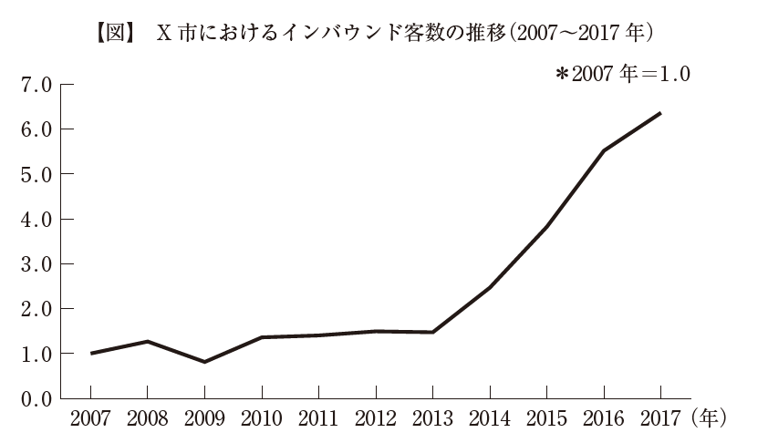

:toc: left
:toclevels: 5
:sectnums:
:stem:
:source-highlighter: coderay

= 事例

== 与件

　B 社は、X 市市街地中心部にある老舗日本旅館である。明治初期に創業し、約150年の歴史をもつ。２ 年前、父親である社長が急死し、民間企業に勤めていた30 歳代後半の長男が急きょ事業を承継することになり、8 代目社長に就任した。資本金は500 万円、従業員は家族従業員3 名、パート従業員４ 名である。このうち1 名は、つい最近雇用した英語に堪能な従業員である。客室は全15 室で、最大収容人員は50名、1 人1 泊朝食付き7,500 円を基本プランとする。裏手には大型バス1 台、乗用車6 台分の駐車場がある。

　簡素な朝食は提供しているものの、客室稼働率に上下があり食材のロスが発生するという理由と調理人の人件費を削減するという理由から、創業以来、夕食は提供していない。宿泊客から夕食を館内でとりたいという要望がある場合は、すぐそばにある地元の割烹料理店からの仕出しで対応している。これまで何度か小さな増改築を行ってきたが、現在の宿泊棟は築45 年である。客室には基本的にずっと手を加えていない。畳と座卓、障子、天井吊り下げ式照明のある、布団を敷くタイプの古風な和室である。館内には大広間があり、その窓からは小ぶりだが和の風情がある苔こけむした庭園を眺めることができる。大浴場はないため、各部屋に洋式トイレとバスを設置している。歴代の社長たちは皆、芸術や文化への造詣が深く、執筆や創作のために長期滞在する作家や芸術家を支援してきた。このため、館内の廊下や共用スペースには、歴代の社長たちが支援してきた芸術家による美術品が随所に配置され、全体として小規模な施設ながらも文化の香りに満ちた雰囲気である。この中には、海外でも名の知られた作家や芸術家もいる。

　X 市は江戸時代から栄えた城下町である。明治時代までは県内随一の商都であり、教育や文化支援にも熱心な土地柄であった。X 市市街地は、北側は城跡付近に造られた官公庁街、東から南側にかけては名刹・古刹が点在する地域となっており、西側には商都の名残である広大な商業地域が広がっている。B 社は創業時からちょうどこの中央に立地し、これらのエリアはいずれも徒歩圏内にある。B 社から最寄り駅までは公共バスを利用して20 分強かかるが、現在、この間を結ぶバスは平均すると1 時間に５ ～ ６ 本程度運行している。この最寄り駅からは国内線と国際線の離発着がある空港に向けて、毎日7 往復の直通バスが走っており、駅から空港までの所要時間は1時間40 分ほどである。

　X 市市街地の中でも、商業地域の目抜き通りには江戸時代の豪商や明治時代の実業家が造り上げた厳かな大型建造物が立ち並ぶ。この通りは現在でも商業地域の顔である。400 年以上続くとされる地域の祭りでは、市内各地を練り歩いてきた豪勢な何台もの山車がこの通りに集結するタイミングで最高の盛り上がりを見せる。夜通し続くこの祭りの見物客は近年、年々増加している。街の一角にはこの祭りの展示施設があり、ここを訪れた観光客は有料で山車を引く体験ができる。X 市商業地域には、歴史を感じさせる大型建造物が残る一方、住民を対象にした店舗もたくさんある。普段遣いのお店から料亭、割烹料理店までのさまざまなタイプの飲食店をはじめ、各種食料品店、和装店、銭湯、劇場、地元の篤志家が建設した美術館などの施設が集積している。

　10 年ほど前、X 市の名刹と商業地域が高視聴率の連続ドラマの舞台となり、このエリアが一躍脚光を浴びた。これを機に、商業地域に拠点をもつ経営者層を中心として、このエリア一体の街並み整備を進めることになった。名刹は通年で夜間ライトアップを行い、地域の動きに協力した。地域ボランティアは観光案内や街の清掃活動を行い、美しい街並みと活気の維持に熱心である。こうした影響を受け、最近では、ほとんどいなかった夜間の滞在人口は増加傾向にある。

　X 市は大都市圏とも近く、電車で２ 時間程度の日帰りできる距離にある。古き良き時代の日本を感じさせるX 市の街のたたずまいは観光地として人気を集めている。2017 年時点で、X 市を訪れる観光客は全体で約500 万人、このうち約20 万人がインバウンド客である。商業地域には空き店舗があったが、観光客が回遊しそうな通り沿いの空き店舗には地元の老舗商店が出店して、シャッター通りにならないための協力体制を敷いた。食べ歩きできるスイーツや地域の伝統を思わせる和菓子などを販売し、街のにぎわい創出に努めた。歴史ある街並みに加え、こうした食べ物などは写真映えし、SNS 投稿に向く。そのため、ここ数年は和の風情を求めるインバウンド客が急増している（図参照）。

　一方、B 社のビジネス手法は創業時からほとんど変わっていなかった。明治時代から仕事や執筆・創作活動のために訪れる宿泊客が常に一定数いたため、たいしたプロモーション活動を行う必要性がなかったのが理由である。それに気付いた8 代目は就任して１ 年後、館内に無料Wi-Fi を導入し、B 社ホームページも開設した。これにより、それまで電話のみで受け付けていた宿泊予約も、ホームページから外国語でも受け付けられるようになった。また、最低限のコミュニケーションが主要な外国語で図れるよう、従業員教育も始めた。近々モバイル決済の導入も考えている。現在、宿泊客は昔なじみのビジネス客８ 割、インバウンド客２ 割であるが、なじみ客らは高齢化が進み、減少傾向にある。最寄り駅から距離のあるB 社には、事前に予約のない客が宿泊することはほとんどない。

　B 社から距離の離れた駅前にはチェーン系ビジネスホテルが2 軒ほどあるが、X 市市街地中心部にはB 社以外に宿泊施設がない。かつてはB 社と似たようなタイプの旅館もあったが、10 年以上前に閉鎖している。B 社周辺にある他の業種の店々は、拡大する観光需要をバネに、このところ高収益を上げていると聞く。B 社だけがこの需要を享受できていない状態だ。

　8 代目は事業承継したばかりで経営の先行きが不透明であるため、宿泊棟の改築などの大規模な投資は当面避けたいと考えている。既存客との関係を考えると、宿泊料金の値上げにも着手したくない。打てる手が限られる中、8 代目が試しに従来の簡素な朝食を日本の朝を感じられる献立に切り替え、器にもこだわってみたところ、多くの宿泊客から喜びの声が聞かれた。こうした様子を目にした8 代目は、経営刷新して営業を継続したいと考えるようになり、中小企業診断士にその方向性を相談した。

（平成30年度　中小企業診断士2次筆記試験　事例2　問題より引用）

== 環境分析

=== 組織図

[plantuml]
----
@startwbs

* B社
** 旅館事業

@endwbs
----

=== ビジネスモデル

[plantuml]
----
@startmindmap

* ビジネスモデル
** 内部環境
*** 顧客
**** 顧客セグメント
*****[#yellow] ビジネス客
***** 国内旅行客
***** 海外観光客（特に英語対応を求める）
*****[#yellow] 長期滞在する作家や芸術家
**** 顧客関係
***** 家族的なもてなしや伝統的な接客
***** 地域文化や歴史を重視した体験提供
*** 価値
**** 価値提案
***** 歴史と伝統に根ざした宿泊体験
***** 和の雰囲気を味わえる古風な和室
*****[#lightgreen] 地元文化・芸術に触れられる小規模な美術展示
***** 作家や芸術家の支援
**** チャネル
***** 直接接触（電話・現地予約）
*****[#lightgreen] 観光サイト・ウェブ予約プラットフォーム
***** 地域観光協会を通じた情報発信
*** インフラ
**** 主要活動
*****[#yellow] 宿泊施設運営
***** 朝食の提供と客室管理
**** 主要リソース
***** 客室15室（畳と和室）
***** 和の庭園付き大広間
*****[#lightgreen] 英語堪能なスタッフ
*****[#lightgreen] 駐車場（大型バス1台、乗用車6台分）
**** 主要パートナー
***** 地元の割烹料理店（仕出し対応）
***** 地域観光協会
*****[#lightgreen] 伝統産業や地元の文化資源
*** 資金
**** 収益源
*****[#yellow] 宿泊料金（例: 朝食付き1泊7,500円の基本プラン）
*****[#yellow] 長期滞在顧客
***** 地域文化体験プランへの付加価値収入
**** コスト構造
***** スタッフ給与（家族従業員+パート従業員）
***** 客室や建物の維持費
***** 朝食提供の材料費
***** パートナー（仕出し代など）利用の外部費用
left side
** 外部環境
*** 競争
**** X市市街地及び周辺の他の老舗旅館
**** 海外観光客向けの宿泊施設
*** 政治・社会・技術
****[#lightblue] 観光振興策による地域支援強化
****[#lightblue] ドラマ等による地域の文化的注目度向上
****[#lightblue] 技術革新（オンライン予約システムの活用など）
*** マクロ経済
****[#red] 国内観光需要の変動
****[#lightblue] 外国人観光客の増加傾向
**** 物価や人件費の上昇
*** 市場
**** 地域特有の観光資源（名刹・古刹、祭り、商業地域）
**** 歴史的市街地としての人気とアクティビティ需要
****[#lightblue] ナイトタイムエコノミーへの進出可能性

@endmindmap
----

=== SWOT分析

[plantuml]
----
@startmindmap

* SWOT
** 内部環境
***[#lightgreen] 強み
**** 創業150年の歴史と伝統、地域での信頼性
**** 文化・芸術への深い関わりによるユニークな付加価値
**** 古風な和室や和庭園による日本らしい体験
**** 地元の割烹料理店との提携でフレキシブルな夕食提供
**** 8代目への家族経営のスムーズな承継
**** 英語対応可能なスタッフの雇用により、訪日外国人対応が可能
***[#yellow] 弱み
**** 家族経営に依存し、経営規模の拡大が限定的
**** 築45年の施設で老朽化が進む宿泊棟や設備
**** 夕食提供を館内で完全に行えないためのサービス制約
**** 客室数15室という小規模施設ゆえの収益限界
**** 周期的な観光需要の波に対して売上が不安定
left side
** 外部環境
***[#lightblue] 機会
**** X市全体の観光整備や地域活性化への積極的な取り組み
**** 地域祭りや文化遺産の利用による観光客誘致
**** ドラマやメディアの影響による訪問客増加
**** 国内外の観光客増加に伴う宿泊需要の高まり
**** オンライン予約プラットフォームの活用で新市場を開拓可能
***[#red] 脅威
**** 競合他社（都市型ホテルや他地域の旅館等）の増加
**** 建物や設備の老朽化による顧客満足度低下のリスク
**** 人件費や物価の上昇によるコスト増
**** 台風や地震など、観光業にダイレクトに影響を与える自然災害
**** 観光需要の減退（パンデミックなど外部要因による）

@endmindmap
----

=== VRIO分析

[plantuml]
----
@startmindmap

* VRIO
** 経済的価値
*** 150年にわたる歴史と伝統、日本ならではの宿泊体験を提供し、地域文化の魅力を加味した価値創造
*** 地元の割烹料理店との提携により、柔軟ながら高品質な食事体験を実現
*** 老舗旅館として観光客に信頼されるブランドと立地条件が収益に貢献
** 希少性
*** 芸術作品の展示や文化的活動支援を特徴としたユニークな運営スタイル
*** 家族経営により継承された伝統や和室の魅力が希少性を高めている
*** 地元の祭りや観光資源との密接な関連性による価値向上
left side
** 模倣困難性
*** 歴史や伝統、文化貢献や地域との関係性は他社が容易に真似できない
*** 家族経営を背景としたもてなしの精神や温かい接客も再現が難しい
*** 館内での芸術や文化価値を備えた空間設計と運営ノウハウ
** 組織能力
*** 小規模ながらも主要パートナー（割烹料理店、地域観光協会）との強い信頼関係が安定運営を支えている
*** 英語対応が可能なスタッフの確保で新たな顧客層への対応力を備える
*** 柔軟なサービスモデル（朝食提供、仕出し夕食など）を確立しつつ運営コストを抑制

@endmindmap
----

== 事業分析

=== 企業戦略

==== ドメイン

[plantuml]
----
@startmindmap

       * ドメイン
       ** 企業ドメイン
       *** 理念
       **** 歴史と伝統を重んじながら、地域文化や芸術の価値を次世代に繋ぐ
       *** ビジョン
       **** 地域に根ざした老舗旅館として、日本の「和」の魅力を世界中の人々に伝える
       *** ミッション
       **** 旅行者に心温まるおもてなしを提供し、多様なニーズに柔軟に対応すると共に地域社会に貢献する

       ** 事業ドメイン
       *** 誰に
       **** 国内観光客
       **** 海外からの旅行者
       **** 長期滞在を求める作家や芸術家
       *** 何を
       **** 伝統的な和室でのくつろげる宿泊体験
       **** 地元文化や芸術に触れる特別な価値
       **** 柔軟な夕食提供を含めたサービスの提供
       *** どのように
       **** 歴史ある施設と和の空間を維持し、家族経営ならではの温かい接客を活かす
       **** 地域の観光資源やパートナーとの連携を通じて魅力を強化
       **** 英語対応スタッフの確保で多文化のお客様にも対応可能とする

       @endmindmap
----

==== 成長戦略

[plantuml]
----
@startmindmap

* 成長戦略
** 既存市場
*** 市場浸透
**** 地元観光協会を通じたプロモーション強化で国内旅行客を更に獲得する
**** リピーター向け特典や長期滞在客向けのプランを増やす
**** オンライン予約プラットフォームの活用による予約の利便性向上
*** 商品開発
**** 季節に応じた地域イベントやアクティビティとの連携プランを開発
**** 室内での文化体験（書道、茶道など）を提供
**** 日本の伝統を学べる短期滞在プログラムの実施

** 新市場
*** 市場開発
**** 海外の旅行会社やプラットフォームと提携し、訪日外国人観光客市場を拡大
**** SNSやWebマーケティングを通じて海外市場での認知度を向上
**** ビジネス客向けに簡易な会議室利用など、異なるターゲット層を誘致
*** 多角化
**** 水平的多角化
***** 伝統工芸品や地域特産品の販売を館内で開始
***** 地域の特産品を用いた朝食やお土産プランの提供
**** 垂直型多角化
***** 自前で夕食を提供できるよう調理設備・スタッフを導入
***** 地域イベントなどへのスポンサーシップ参画によりブランド強化
**** 集中型多角化
***** 他の老舗旅館と連携して共同イベントや宿泊プランを展開
***** 温泉施設の追加や新しい和モダンスタイル客室の導入
**** 集成型多角化
***** 地域文化や芸術展示専用のサテライト施設を設置し、観光拠点の役割を担う
***** 地域特産の食材を活用した独自レストラン経営も検討

@endmindmap
----

==== イシューツリー

[plantuml]
----
@startmindmap

* イシューツリー
left side
** ドメイン
right side
** 成長戦略

@endmindmap
----

=== 事業戦略

==== 基本戦略

[plantuml]
----
@startmindmap

* 基本戦略
** コストリーダーシップ
*** 家族経営により人件費を抑えつつ、安定した運営を実現
*** 規模を維持しつつ柔軟な運営方式でコスト増を回避
*** 外部提携（割烹料理店など）を活用し、設備投資を最小限に
** 差別化
*** 創業150年の歴史と伝統に基づく唯一無二の宿泊体験を提供
*** 和の雰囲気を大切にした和室と庭園による特別な空間を演出
*** 地域文化や芸術への貢献や展示を宿泊体験と組み合わせて提供
*** 英語対応スタッフによる海外旅行客への丁寧な接客対応
** 集中
*** 伝統文化や地域観光資源を求めるニッチ市場へ特化
*** 国内の旅行客や海外からの文化体験を重視する観光客を主なターゲットとする
*** 小規模な施設を活かし、長期滞在や少人数向けプレミアム体験に焦点を当てる

@endmindmap
----

==== 競争戦略

[plantuml]
----
@startmindmap

* 競争戦略
** リーダー
*** 市場拡大
**** 地域文化や歴史を活かしたプロモーションで新規顧客層の開拓
**** 訪日外国人観光客向けのプランを充実させ、市場シェアを拡大
*** 同質化
**** 地域他旅館と比較し、差別化ポイントを補完する形で一部類似サービス（温泉、和食メニュー）を提供
**** 競争力のある価格設定を意識し、宿泊ニーズに応える

** チャレンジャー
*** 差別化
**** 日本ならではの伝統と歴史を重視した体験型宿泊を提供
**** 芸術作品の展示や地域文化体験など、独自要素を持ち込む
**** 家族経営の温かみある接客で大手ホテルとの差別化を図る

** ニッチャー
*** 集中
**** 文化体験や伝統価値を求める特定の市場（歴史好き、文化研究者）に特化
**** 地域特有のイベントや季節限定観光客をターゲットとする
**** 小規模ながら高品質な体験を提供し、プレミアム市場に注力

** フォロワー
*** 追随
**** 他の成功事例（地域連携モデルやオンライン予約対応）を柔軟に取り入れる
**** 観光地情報発信やSNS活用など、一般的な競争戦略を採用
**** 他施設の付加価値サービスを分析し、自社対応可能なものを選択的に実施

@endmindmap
----

==== 価値連鎖

[plantuml]
----
@startmindmap

* 価値連鎖
** 主活動
*** 購買物流
**** 地元の割烹料理店や地域特産品業者からの食材や備品調達を実施
**** 季節に応じた食材や装飾品を選定し、伝統や地域性を反映
*** マーケティング・販売
**** 地域観光資源や歴史を活かしたプロモーション活動を展開
**** オンライン予約サイトやSNSによる情報発信で新規顧客の獲得
**** 外国語対応を強化し、訪日観光客をターゲットにした広告展開
*** サービス
**** 和室の維持管理と清掃、伝統的な空間づくりに注力
**** 地域文化を活かした宿泊体験やイベント企画の運営
**** 宿泊者への迅速で行き届いたサービス提供
**** 顧客のニーズに応える形で食事やアメニティを時間通りに提供
**** チェックイン・チェックアウト時の丁寧な対応と接客
**** トラブル対応を瞬時に解決できる家族経営の柔軟性活用
**** 滞在中のお客様に地域案内や観光情報を提供

** 支援活動
*** インフラストラクチャ
**** 宿泊施設および庭園の設備維持・リノベーション
**** 財務管理を効率化し、小規模運営でも収益性を確保
*** 人事・労務管理
**** スタッフ全員が多機能的に対応可能な体制を確立
**** 家族経営特有の連携の強化と外部スタッフの採用で人員不足を補う
*** 技術開発
**** オンライン予約システムや顧客管理システムの導入
**** 地域観光資源と連携した新しい宿泊プランの開発
*** 調達活動
**** 地元業者との長期的な関係構築で安定的な食材・備品調達
**** 依頼先（割烹料理店など）の品質管理と定期的な見直し

@endmindmap
----

==== イシューツリー

[plantuml]
----
@startmindmap

* イシューツリー
left side
** 基本戦略
** 競争戦略
right side
** 価値連鎖

@endmindmap
----

=== 機能戦略

==== バリューストリーム

[plantuml]
----
@startmindmap

* バリューストリーム
left side
** 主活動
*** マーケティング
*** サービス

** 支援活動
*** 技術開発
*** 人事
*** 会計
*** インフラストラクチャ

right side
** 戦略
*** マーケティング
**** 製品
***** 地域の文化と観光資源を駆使した独自性の高い宿泊体験
**** 価格
***** 観光業界における競争力を意識した料金設定
**** チャネル
***** SNS、オンライン予約サイトなどデジタルチャネル活用
**** プロモーション
***** 地域の歴史を強調した広告展開
***** 外国語対応を含む訪日観光客向けプロモーション
*** 市場調査
**** 観光業界や地域文化のトレンド把握
**** 海外および国内観光客層の動向分析
*** 店舗計画
**** 宿泊施設内の顧客動線・空間デザイン最適化

** 販売管理
*** 受注管理
**** 訪問・オンライン予約の受付最適化
*** 売上管理
**** 財務管理ソフトウェアを用いた収益分析

** 在庫管理
*** 在庫管理
**** 食材や装飾品等の在庫監視と管理
*** 受払管理
**** 地元業者とのタイムリーな支払い確保
*** 棚卸管理
**** 定期的な棚卸で安定した供給を維持

** 調達管理
*** 発注管理
**** 地元業者との安定した調達方法の構築
*** 入荷管理
**** 季節ごとの素材に合わせた受取計画の最適化
*** 仕入管理
**** 割烹料理店や地域特産品業者との品質契約維持

** 店舗管理
*** 資材管理
**** 滞在者サービスに必要な資材の管理
*** 衛生管理
**** 宿泊施設および食材の衛生水準を厳守

** 人事管理
*** 給与計算
**** 家族および外部スタッフ双方の給与計算
*** 人的資源管理
**** 雇用管理
***** 地元人材採用を優先
**** 能力開発
***** 宿泊業用スキル向上プログラム
**** 報酬管理
***** 柔軟な給与形態の導入
**** 評価制度
***** 家族経営の円滑な成果評価方式

@endmindmap
----

==== ケイパビリティマッピング

[plantuml]
----
@startmindmap

* ビジネスケイパビリティマップ
** コア
*** 戦略
**** マーケティング
***** 製品
****** 地域の文化と観光資源を駆使した独自性の高い宿泊体験
***** 価格
****** 観光業界における競争力を意識した料金設定
***** チャネル
****** SNS、オンライン予約サイトなどデジタルチャネル活用
***** プロモーション
****** 地域の歴史を強調した広告展開
****** 外国語対応を含む訪日観光客向けプロモーション
**** 店舗計画
***** 宿泊施設内の顧客動線・空間デザイン最適化
*** 人事管理
**** 人的資源管理
***** 雇用管理
****** 地元人材採用を優先
***** 能力開発
****** 宿泊業用スキル向上プログラム
***** 報酬管理
****** 柔軟な給与形態の導入
***** 評価制度
****** 家族経営の円滑な成果評価方式
** 汎用
*** 販売管理
**** 受注管理
***** 訪問・オンライン予約の受付最適化
**** 売上管理
***** 財務管理ソフトウェアを用いた収益分析
*** 在庫管理
**** 在庫管理
***** 食材や装飾品等の在庫監視と管理
**** 受払管理
***** 地元業者とのタイムリーな支払い確保
**** 棚卸管理
***** 定期的な棚卸で安定した供給を維持
*** 調達管理
**** 発注管理
***** 地元業者との安定した調達方法の構築
**** 入荷管理
***** 季節ごとの素材に合わせた受取計画の最適化
**** 仕入管理
***** 割烹料理店や地域特産品業者との品質契約維持
*** 店舗管理
**** 資材管理
***** 滞在者サービスに必要な資材の管理
**** 衛生管理
***** 宿泊施設および食材の衛生水準を厳守
** サポート
*** 市場調査
**** 観光業界や地域文化のトレンド把握
**** 海外および国内観光客層の動向分析
*** 人事管理
**** 給与計算
***** 家族および外部スタッフ双方の給与計算

@endmindmap
----

==== 組織マップ
[plantuml]
----
@startmindmap

* B社
** 旅館事業
*** マーケティング
*** 人事管理
*** 販売管理
*** 在庫管理
*** 調達管理
*** 店舗管理
*** 市場調査

left side
** コア
*** 戦略
**** マーケティング
***** 製品
****** 地域の文化と観光資源を駆使した独自性の高い宿泊体験
***** 価格
****** 観光業界における競争力を意識した料金設定
***** チャネル
****** SNS、オンライン予約サイトなどデジタルチャネル活用
***** プロモーション
****** 地域の歴史を強調した広告展開
****** 外国語対応を含む訪日観光客向けプロモーション
**** 店舗計画
***** 宿泊施設内の顧客動線・空間デザイン最適化
*** 人事管理
**** 人的資源管理
***** 雇用管理
****** 地元人材採用を優先
***** 能力開発
****** 宿泊業用スキル向上プログラム
***** 報酬管理
****** 柔軟な給与形態の導入
***** 評価制度
****** 家族経営の円滑な成果評価方式
** 汎用
*** 販売管理
**** 受注管理
***** 訪問・オンライン予約の受付最適化
**** 売上管理
***** 財務管理ソフトウェアを用いた収益分析
*** 在庫管理
**** 在庫管理
***** 食材や装飾品等の在庫監視と管理
**** 受払管理
***** 地元業者とのタイムリーな支払い確保
**** 棚卸管理
***** 定期的な棚卸で安定した供給を維持
*** 調達管理
**** 発注管理
***** 地元業者との安定した調達方法の構築
**** 入荷管理
***** 季節ごとの素材に合わせた受取計画の最適化
**** 仕入管理
***** 割烹料理店や地域特産品業者との品質契約維持
*** 店舗管理
**** 資材管理
***** 滞在者サービスに必要な資材の管理
**** 衛生管理
***** 宿泊施設および食材の衛生水準を厳守
** サポート
*** 市場調査
**** 観光業界や地域文化のトレンド把握
**** 海外および国内観光客層の動向分析
*** 人事管理
**** 給与計算
***** 家族および外部スタッフ双方の給与計算

@endmindmap
----

==== 情報マップ

==== ビジネスシナリオ

==== イシューツリー

[plantuml]
----
@startmindmap

* イシューツリー
** 会社
*** 事業A
**** 部門
***** 課
*** 事業B
**** 部門
***** 課
*** 事業C
**** 部門
***** 課
left side
** 戦略
*** マーケティング
**** 製品
**** 価格
**** チャネル
**** プロモーション
*** 市場調査
*** 販売計画
*** 店舗計画
** 生産管理
*** 生産計画
*** MRP
*** 工程管理
*** 製造管理
** 販売管理
*** 受注管理
*** 出荷管理
*** 売上管理
** 在庫管理
*** 在庫管理
*** 受払管理
*** 棚卸管理
** 調達管理
*** 発注管理
*** 入荷管理
*** 仕入管理
** 店舗管理
*** 資材管理
*** 衛生管理
** 人事管理
*** 給与計算
*** 人的資源管理
**** 雇用管理
**** 能力開発
**** 報酬管理
**** 評価制度

@endmindmap
----

== 業務分析

[plantuml]
----
@startmindmap

* ドメイン

left side
** 企業ドメイン
*** 理念
*** ビジョン
*** ミッション
** 事業ドメイン
*** 誰に
*** 何を
*** どのように

right side

** サブドメイン
*** コアサブドメイン
*** 汎用サブドメイン
*** サポートサブドメイン

@endmindmap
----

=== 業務領域(サブドメイン)

==== 中核の業務領域(コアサブドメイン)

==== 一般的な業務領域(汎用サブドメイン)

==== 補完的な業務領域(サポートサブドメイン)

=== ビジネスコンテキスト

=== ビジネスユースケース

==== 業務

===== ユースケース図

[plantuml]
----
@startuml

title ビジネスユースケース

@enduml
----

==== シーケンス図

[plantuml]
----
@startuml

title 業務シーケンス図

@enduml
----

==== 業務フロー図

===== 業務

[plantuml]
----
@startuml

title 業務フロー

@enduml
----

