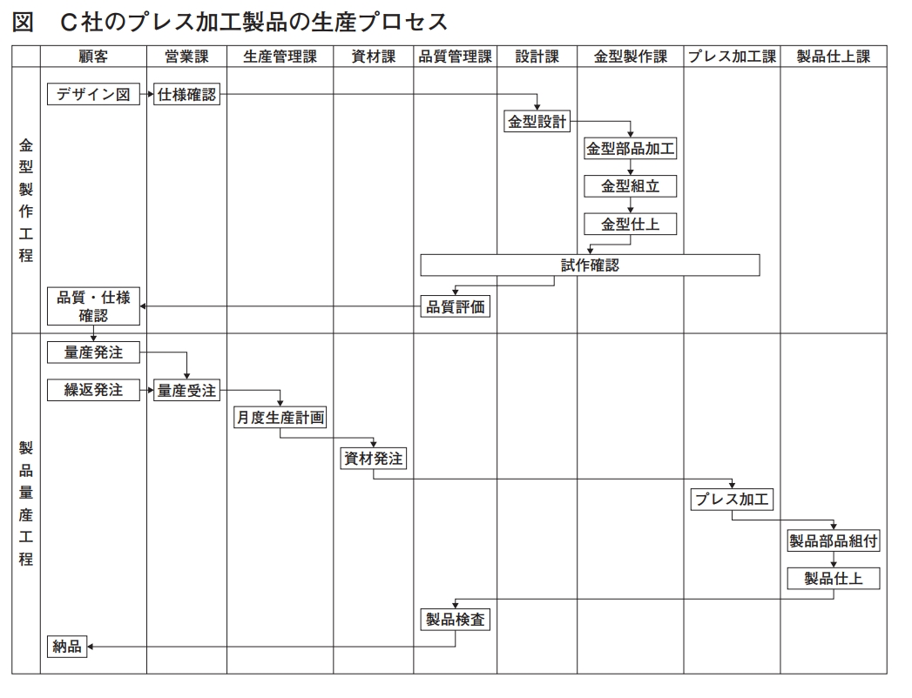

:toc: left
:toclevels: 5
:sectnums:
:stem:
:source-highlighter: coderay

= 金属製品製造業であるC社の事例

== 与件

【企業概要】

　C社は1964 年創業、資本金2,500 万円、従業員60 名の金属製品製造業である。製品は、売上の7 割を占めるアルミニウムおよびステンレス製プレス加工製品（以下「プレス加工製品」という）と、残り3 割のステンレス製板金加工製品（以下「板金加工製品」という）である。プレス加工製品は金型を使用して成形する鍋、トレー、ポットなどの繰返受注製品で、板金加工製品は鋼材を切断や曲げ、溶接加工して製作する調理台、収納ラック、ワゴンなどの個別受注製品である。どちらもホテル、旅館、外食産業などの調理場で使用される製品で、業務用食器・什器の卸売企業2 社を販売先としている。

　C社は、卸売企業が企画する業務用什器の板金加工製品を受託生産する企業として創業した。その後金属プレスや金型製作設備を導入してプレス加工製品の生産を始めている。難易度の高い金型製作技術の向上に努めて、ノウハウを蓄積してきたため、コスト低減や生産性向上に結びつく提案などが可能である。

　近年は観光需要で受注量は毎年増加していたが、2020 年からの新型コロナウイルス感染拡大による外国人の新規入国規制や、外食産業の営業自粛による影響を受けて減少している。

【生産の現状】

　生産部門は、生産管理課、資材課、設計課、金型製作課、プレス加工課、製品仕上課、板金加工課、品質管理課で構成されている。

　プレス加工製品の生産プロセスには、金型を製作する金型製作工程と、その金型を利用して同じ製品の繰返受注生産を行う製品量産工程がある（次ページの図参照）。

　C社の金型製作工程は、発注元から提示される形状やサイズの概要を表したデザイン図を基に仕様を確認した後に「金型設計」を行い、金型を構成する部品を製作する「金型部品加工」、加工した部品を組み立てる「金型組立」、その後の調整や研磨などを行う「金型仕上」を経て、「試作確認」を行い、さらに試作品の品質を発注元との間で確認して完成する。設計開始から完成までの金型製作期間は、難易度によって異なるが、短いもので約2週間、長いもので約1か月を要する。

　「金型設計」は、設計課が2次元CAD を活用し担当している。発注元との仕様確認が遅くなることや、発注元からの設計変更、仕様変更の要請があり、設計期間が長くなることもある。また設計課では、個別受注の板金加工製品の製品設計も担当するため、設計業務の混乱が生じ金型製作期間全体に影響することもしばしば生じている。

　「金型組立」、「金型仕上」は、プレス加工技術にも習熟するベテラン技能者が担当しているが、高齢化している。担当者は、金型の修理や改善作業も兼務し、製品の品質や製造コストに影響を及ぼす重要なスキルが必要なことから、若手の養成を検討している。

　金型が完成した後の製品量産工程は、発注元から納品月の前月中旬に製品別の生産依頼数と納品指定日が通知され、それに基づいて前月月末までに「月度生産計画」を作成して「資材発注」する。プレス加工課では「プレス加工」を行い、製品仕上課で取っ手などの部品を組み付ける「製品部品組付」と製品の最終調整をする「製品仕上」を行い、通常月1 回発注元へ納品する。

　C社の「プレス加工」は、生産能力に制約があり、C 社全体の生産進捗に影響している。プレス加工機ごとに担当する作業員が材料の出し入れと設備操作を行い、加工製品を変えるときには、その作業員が金型交換作業と材料準備作業など長時間の段取作業を一人で行っている。

　プレス加工製品の生産計画は「プレス加工」の計画だけが立案され、「製品部品組付」、「製品仕上」はプレス加工終了順に作業する。生産計画は、各製品の1 日間の加工数量でそれぞれの基準日程を決めて立案する。以前は発注元もこれを理解して、C社の加工ロットサイズを基本に発注し、C 社で生産した全量を受領して、発注元で在庫対応していた。しかし、最近は発注元の在庫量削減方針によって発注ロットサイズが減少している。ただC 社では、基準日程によって設定しているロットサイズで加工を続け、確定受注量以外はC 社内で在庫している。

　C社の受注から納品に至る社内業務では、各業務でパソコンを活用しているが、情報の交換と共有はいまだに紙ベースで行われている。

【新規製品事業】

　数年前C社では受注拡大を狙って、雑貨・日用品の商談会に出展したことがある。その際商談成立には至らなかったが、中堅ホームセンターX 社から品質を高く評価された。今回そのX 社から新規取引の商談が持ち込まれた。

　X社では、コロナ禍の2020 年以降も売上が順調に推移しているが、その要因の一つとしてアウトドア商品売上の貢献がある。しかし新型コロナウイルスのパンデミックにより、中国や東南アジア諸国企業に生産委託しているPB 商品の納品に支障が生じて、生産、物流など現在のサプライチェーンの維持が難しくなっている。また今後も海外生産委託商品の仕入れ価格の高騰が懸念されることから、生産委託先をC 社へ変更することについてC 社と相互に検討を行った。

　C社社長は、当該事業の市場成長性と自社の強みを考慮して戦略とビジネスプロセスを見直し、積極的にこの事業に取り組むこととした。

　X社の要請は、X 社のアウトドア用PB 商品のうち、中価格帯の食器セット、鍋、その他調理器具などアルミニウム製プレス加工製品の生産である。ただC 社社長は、今後高価格な製品に拡大することも期待している。

X社からの受注品は、商品在庫と店舗仕分けの機能を持つ在庫型物流センターへの納品となり、商品の発注・納品は、次のようになる。まず四半期ごとにX 社が商品企画と月販売予測を立案し、C 社に情報提供される。確定納品情報については、X社各店舗の発注データを毎週月曜日にX 社本社で集計する。在庫量からその集計数を差し引いて発注点に達した製品についてX 社の発注データがC 社に送付される。納期は発注日から7 日後の設定である。1 回の発注ロットサイズは、現状のプレス加工製品と比べるとかなり小ロットになる。

（令和4年度　中小企業診断士2次筆記試験　事例3　問題より引用）

== 環境分析

=== 組織図

[plantuml]
----
@startwbs

* C社
** 営業部門
*** 営業課
** 生産部門
*** 生産管理課
*** 資材課
*** 設計課
*** 金型製作課
*** プレス加工課
*** 製品仕上課
*** 板金加工課
*** 品質管理課

@endwbs
----

=== ビジネスモデル

[plantuml]
----
@startmindmap
* ビジネスモデル
** 内部環境
*** 顧客
**** 顧客セグメント(CS)
***** ホテル、旅館、外食産業など
***** アウトドアに関心のある消費者
*** 価値
**** 価値提案(VP)
***** プレス加工製品は金型を使用して成形する鍋、トレー、ポットなどの繰返受注製品
***** 板金加工製品は鋼材を切断や曲げ、溶接加工して製作する調理台、収納ラック、ワゴンなどの個別受注製品
***** X社のアウトドア用PB 商品のうち、中価格帯の食器セット、鍋、その他調理器具などアルミニウム製プレス加工製品の生産
*****[#orange] 新規製品事業
****** C社社長は、当該事業の市場成長性と自社の強みを考慮して戦略とビジネスプロセスを見直し、積極的にこの事業に取り組むこととした
****** 今後高価格な製品に拡大することも期待している
**** チャネル(CH)
***** 業務用食器・什器の卸売企業2 社
*** インフラ
**** 主要活動(KA)
*****[#lightgreen] 難易度の高い金型製作技術の向上に努めて、ノウハウを蓄積してきたため、コスト低減や生産性向上に結びつく提案などが可能である
***** プレス加工製品の生産プロセスには、金型を製作する金型製作工程と、その金型を利用して同じ製品の繰返受注生産を行う製品量産工程がある
***** 金型製作工程
****** C社の金型製作工程は、発注元から提示される形状やサイズの概要を表したデザイン図を基に仕様を確認した後に「金型設計」を行い、金型を構成する部品を製作する「金型部品加工」、加工した部品を組み立てる「金型組立」、その後の調整や研磨などを行う「金型仕上」を経て、「試作確認」を行い、さらに試作品の品質を発注元との間で確認して完成する
****** 難易度によって異なるが、短いもので約2週間、長いもので約1か月を要する
****** 「金型設計」は、設計課が2次元CAD を活用し担当している
******[#yellow] 発注元との仕様確認が遅くなることや、発注元からの設計変更、仕様変更の要請があり、設計期間が長くなることもある
******[#yellow] また設計課では、個別受注の板金加工製品の製品設計も担当するため、設計業務の混乱が生じ金型製作期間全体に影響することもしばしば生じている
****** 金型が完成した後の製品量産工程は、発注元から納品月の前月中旬に製品別の生産依頼数と納品指定日が通知され、それに基づいて前月月末までに「月度生産計画」を作成して「資材発注」する
***** 製品量産工程
****** プレス加工課では「プレス加工」を行い、製品仕上課で取っ手などの部品を組み付ける「製品部品組付」と製品の最終調整をする「製品仕上」を行い、通常月1 回発注元へ納品する
******[#yellow] C社の「プレス加工」は、生産能力に制約があり、C 社全体の生産進捗に影響している
******* プレス加工機ごとに担当する作業員が材料の出し入れと設備操作を行い、加工製品を変えるときには、その作業員が金型交換作業と材料準備作業など長時間の段取作業を一人で行っている

*****[#orange] 新規製品事業
****** X社からの受注品は、商品在庫と店舗仕分けの機能を持つ在庫型物流センターへの納品となり、商品の発注・納品は、次のようになる
****** １回の発注ロットサイズは、現状のプレス加工製品と比べるとかなり小ロットになる
**** 主要リソース(KR)
***** 資本金2,500 万円、従業員60 名
***** 生産部門は、生産管理課、資材課、設計課、金型製作課、プレス加工課、製品仕上課、板金加工課、品質管理課で構成されている
*****[#yellow] 「金型組立」、「金型仕上」は、プレス加工技術にも習熟するベテラン技能者が担当しているが、高齢化している
*****[#yellow] C社の受注から納品に至る社内業務では、各業務でパソコンを活用しているが、情報の交換と共有はいまだに紙ベースで行われている
**** 主要パートナー(KP)
***** 中堅ホームセンターX 社
*** 資金
**** 収益源(R$)
***** 製品は、売上の7 割を占めるアルミニウムおよびステンレス製プレス加工製品と、残り3 割のステンレス製板金加工製品
**** コスト構造(C$)
*****[#yellow] しかし、最近は発注元の在庫量削減方針によって発注ロットサイズが減少している。ただC 社では、基準日程によって設定しているロットサイズで加工を続け、確定受注量以外はC 社内で在庫している
left side
** 外部環境
*** 競争(XC)
*** 政治・社会・技術(XS)
*** マクロ経済(XE)
*** 市場(XM)
****[#red] 2020年からの新型コロナウイルス感染拡大による外国人の新規入国規制や、外食産業の営業自粛による影響を受けて減少している
**** X社では、コロナ禍の2020 年以降も売上が順調に推移しているが、その要因の一つとしてアウトドア商品売上の貢献がある。しかし新型コロナウイルスのパンデミックにより、中国や東南アジア諸国企業に生産委託しているPB 商品の納品に支障が生じて、生産、物流など現在のサプライチェーンの維持が難しくなっている。
****[#lightblue] また今後も海外生産委託商品の仕入れ価格の高騰が懸念されることから、生産委託先をC 社へ変更することについてC 社と相互に検討を行った
@endmindmap
----

=== SWOT分析

[plantuml]
----
@startmindmap

* SWOT
** 内部環境
***[#lightgreen] 強み
**** 金型製作技術の向上に努め、ノウハウの蓄積に成功している
**** 繰返受注製品の生産プロセスが確立している
**** アルミニウムやステンレス製プレス加工製品での実績
***[#yellow] 弱み
**** 総じて高齢化しているベテラン技能者に依存している
**** 設計変更や仕様変更が頻繁に発生し、設計期間が延びることがある
**** 情報の交換と共有がいまだに紙ベースで行われている
**** プレス加工の生産能力に制約があり、生産進捗に影響を及ぼす
**** 資金面の制約や、小ロットの発注による在庫管理の問題
left side
** 外部環境
***[#lightblue] 機会
**** 新規製品事業の市場成長性
**** 高価格な製品への拡大の可能性
**** X社とのパートナーシップ
***[#red] 脅威
**** 発注元の在庫量削減方針による発注ロットサイズの減少
**** 業界内の競争が厳しい

@endmindmap
----

=== VRIO分析

[plantuml]
----
@startmindmap
* VRIO
** 経済的価値
*** 難易度の高い金型製作技術の向上とノウハウの蓄積
*** 繰返受注製品の安定した生産プロセス
** 希少性
*** アルミニウムやステンレス製プレス加工製品における専門知識と実績
*** 熟練技能者による金型製作と仕上げの高い技術力
left side
** 模倣困難性
*** 技術面では模倣が困難な金型製作技術
*** 作業プロセスの標準化とノウハウの蓄積により生産コストの低減
** 組織能力
@endmindmapp
----

== 事業分析

=== 企業戦略

==== ドメイン

[plantuml]
----
@startmindmap

* ドメイン
** C社
*** 営業部門
**** 営業課
*** 生産部門
**** 生産管理課
**** 資材課
**** 設計課
**** 金型製作課
**** プレス加工課
**** 製品仕上課
**** 板金加工課
**** 品質管理課
left side
** 企業ドメイン
*** 理念
**** 高品質で価値ある製品を提供し、顧客満足度を最大化する
*** ビジョン
**** 金型製作技術のリーダーとして、新規製品事業で市場シェアを拡大する
*** ミッション
**** 高度な技術と専門知識を通じて、持続可能な成長と利益を達成する
** 事業ドメイン
*** 既存事業
**** 誰に
***** ホテル、旅館、外食産業などの企業
**** 何を
***** アルミニウムおよびステンレス製プレス加工製品、板金加工製品
**** どのように
*****[#yellow]  金型製作技術の向上とノウハウの活用、効率的な生産プロセス
***[#orange] 新製品事業
**** 誰に
***** X社などの大手企業
**** 何を
***** 中価格帯のアウトドア用PB商品、食器セット、鍋、調理器具など
**** どのように
***** 戦略的な市場分析と積極的な市場投入、在庫型物流センターの活用

@endmindmap
----

==== 成長戦略

[plantuml]
----
@startmindmap

* 成長戦略
** 既存市場
*** 市場浸透
**** 既存顧客への販売促進活動の強化
**** 価格競争力の向上とセールスプロモーション
***[#orange] 商品開発
****[#orange] 新規製品事業の強化（アウトドア用PB商品、調理器具など）
****[#orange] 高付加価値商品の開発と販売
** 新市場
*** 市場開発
**** 新たな地域市場の開拓
**** B2Bマーケットプレイスへの参入
*** 多角化
**** 水平的多角化
***** 新規事業を既存技術を生かして展開
***** 新しい商品カテゴリーの追加
**** 垂直型多角化
***** サプライチェーン管理と物流の取り組み強化
***** 自社による製品流通経路の構築
**** 集中型多角化
***** 既存ビジネスの技術や資源を活かした新規事業参入
***** 価値提案の多様化による収益の安定化
**** 集成型多角化
***** パートナーシップ戦略による事業開発
***** 異業種の知見を取り入れた事業革新

@endmindmap
----

==== イシューツリー

[plantuml]
----
@startmindmap

* イシューツリー
left side
** ドメイン
*** 企業ドメイン
**** 理念
***** 高品質で価値ある製品を提供し、顧客満足度を最大化する
**** ビジョン
***** 金型製作技術のリーダーとして、新規製品事業で市場シェアを拡大する
**** ミッション
***** 高度な技術と専門知識を通じて、持続可能な成長と利益を達成する
*** 事業ドメイン
**** 既存事業
***** 誰に
****** ホテル、旅館、外食産業などの企業
***** 何を
****** アルミニウムおよびステンレス製プレス加工製品、板金加工製品
***** どのように
******[#yellow]  金型製作技術の向上とノウハウの活用、効率的な生産プロセス
****[#orange] 新製品事業
***** 誰に
****** X社などの大手企業
***** 何を
****** 中価格帯のアウトドア用PB商品、食器セット、鍋、調理器具など
***** どのように
****** 戦略的な市場分析と積極的な市場投入、在庫型物流センターの活用
right side
** 成長戦略
*** 既存市場
**** 市場浸透
***** 既存顧客への販売促進活動の強化
***** 価格競争力の向上とセールスプロモーション
****[#orange] 商品開発
*****[#orange] 新規製品事業の強化（アウトドア用PB商品、調理器具など）
*****[#orange] 高付加価値商品の開発と販売
*** 新市場
**** 市場開発
***** 新たな地域市場の開拓
***** B2Bマーケットプレイスへの参入
**** 多角化
***** 水平的多角化
****** 新規事業を既存技術を生かして展開
****** 新しい商品カテゴリーの追加
***** 垂直型多角化
****** サプライチェーン管理と物流の取り組み強化
****** 自社による製品流通経路の構築
***** 集中型多角化
****** 既存ビジネスの技術や資源を活かした新規事業参入
****** 価値提案の多様化による収益の安定化
***** 集成型多角化
****** パートナーシップ戦略による事業開発
****** 異業種の知見を取り入れた事業革新

@endmindmap
----

=== 事業戦略

==== 基本戦略

[plantuml]
----
@startmindmap

* 基本戦略
** コストリーダーシップ
*** 金型製作技術の向上によるコスト低減
***[#yellow] プレス加工製品の効率的な生産プロセス
** 差別化
*** 高品質なプレス加工製品と板金加工製品
***[#orange] 新規製品事業の積極的な取り組み
*** 設計課による高度な技術設計
** 集中
***[#orange] アウトドア用PB商品の生産
*** 業務用食器・什器の卸売企業との取引
*** 中堅ホームセンターX社とのパートナーシップ

@endmindmap
----

==== 競争戦略

[plantuml]
----
@startmindmap

* 競争戦略
** リーダー
*** 中堅ホームセンターX社とのパートナーシップを活用して市場拡大
*** 高品質なプレス加工製品の提供による市場シェアの確保
** チャレンジャー
***[#orange] 新規製品事業で差別化を図り、新たな市場を狙う
** ニッチャー
*** 業務用食器・什器の卸売企業との取引に集中
** フォロワー
*** 他社の成功事例を参考にして追随し、改善策を講じる

@endmindmap
----

==== 価値連鎖

[plantuml]
----
@startmindmap
* 価値連鎖
** 主活動
*** 購買物流
**** プレス加工製品の資材発注
*** 製造
**** 金型製作技術の向上と製品量産工程
****[#yellow] プレス加工製品の効率的な生産プロセス
****[#orange] 新規製品事業の小ロット生産
*** 出荷物流
**** 在庫型物流センターへの納品
*** マーケティング・販売
****[#orange] アウトドア用PB商品の市場分析と販売促進
*** サービス
**** 高品質な製品の提供と顧客満足度の向上
** 支援活動
*** インフラストラクチャ
**** 生産管理システム
****[#yellow] 紙ベースからデジタル化への移行
*** 人事・労務管理
****[#yellow] 熟練技能者の高齢化対策
*** 技術開発
**** 金型設計と新製品の技術開発
*** 調達活動
**** サプライチェーンの最適化
@endmindmap
----

==== イシューツリー

[plantuml]
----
@startmindmap

* イシューツリー

left side

** 基本戦略
*** コストリーダーシップ
**** 金型製作技術の向上によるコスト低減
****[#yellow] プレス加工製品の効率的な生産プロセス
*** 差別化
**** 高品質なプレス加工製品と板金加工製品
****[#orange] 新規製品事業の積極的な取り組み
**** 設計課による高度な技術設計
*** 集中
****[#orange] アウトドア用PB商品の生産
**** 業務用食器・什器の卸売企業との取引
**** 中堅ホームセンターX社とのパートナーシップ

** 競争戦略
*** リーダー
**** 中堅ホームセンターX社とのパートナーシップを活用して市場拡大
**** 高品質なプレス加工製品の提供による市場シェアの確保
*** チャレンジャー
****[#orange] 新規製品事業で差別化を図り、新たな市場を狙う
*** ニッチャー
**** 業務用食器・什器の卸売企業との取引に集中
*** フォロワー
**** 他社の成功事例を参考にして追随し、改善策を講じる

right side

** 価値連鎖
*** 主活動
**** 購買物流
***** プレス加工製品の資材発注
**** 製造
***** 金型製作技術の向上と製品量産工程
*****[#yellow] プレス加工製品の効率的な生産プロセス
*****[#orange] 新規製品事業の小ロット生産
**** 出荷物流
***** 在庫型物流センターへの納品
**** マーケティング・販売
*****[#orange] アウトドア用PB商品の市場分析と販売促進
**** サービス
***** 高品質な製品の提供と顧客満足度の向上
*** 支援活動
**** インフラストラクチャ
***** 生産管理システム
*****[#yellow] 紙ベースからデジタル化への移行
**** 人事・労務管理
*****[#yellow] 熟練技能者の高齢化対策
**** 技術開発
***** 金型設計と新製品の技術開発
**** 調達活動
***** サプライチェーンの最適化

@endmindmap
----

=== 機能戦略

==== 販売

==== 生産

==== 購買

==== 総務

==== 財務

==== 資源

==== イシューツリー

[plantuml]
----
@startmindmap

* イシューツリー
** 販売
** 生産
** 購買
** 総務
** 財務
** 資源
left side
** 価値連鎖
*** 主活動
**** 購買物流
***** プレス加工製品の資材発注
**** 製造
***** 金型製作技術の向上と製品量産工程
*****[#yellow] プレス加工製品の効率的な生産プロセス
*****[#orange] 新規製品事業の小ロット生産
**** 出荷物流
***** 在庫型物流センターへの納品
**** マーケティング・販売
*****[#orange] アウトドア用PB商品の市場分析と販売促進
**** サービス
***** 高品質な製品の提供と顧客満足度の向上
*** 支援活動
**** インフラストラクチャ
***** 生産管理システム
*****[#yellow] 紙ベースからデジタル化への移行
**** 人事・労務管理
*****[#yellow] 熟練技能者の高齢化対策
**** 技術開発
***** 金型設計と新製品の技術開発
**** 調達活動
***** サプライチェーンの最適化

@endmindmap
----

== 業務分析

[plantuml]
----
@startmindmap

* ドメイン

left side
** 企業ドメイン
*** 理念
*** ビジョン
*** ミッション
** 事業ドメイン
*** 誰に
*** 何を
*** どのように

right side

** サブドメイン
*** コアサブドメイン
*** 汎用サブドメイン
*** サポートサブドメイン

@endmindmap
----

=== 業務領域(サブドメイン)

==== 中核の業務領域(コアサブドメイン)

==== 一般的な業務領域(汎用サブドメイン)

==== 補完的な業務領域(サポートサブドメイン)

=== ビジネスコンテキスト

=== ビジネスユースケース

==== 業務

===== ユースケース図

[plantuml]
----
@startuml

title ビジネスユースケース

@enduml
----

==== シーケンス図

[plantuml]
----
@startuml

title 業務シーケンス図

@enduml
----

==== 業務フロー図

===== 業務

[plantuml]
----
@startuml

title 業務フロー

@enduml
----

